# Bug & Usability Findings Log

Dưới đây là danh sách tổng hợp tất cả các lỗi (Bug) và vấn đề tính tiện dụng (Usability) được trích xuất từ kết quả của Task 1 (Phân tích Heuristic), Task 2 (Usability Testing), và Task 3 (Cross-browser Testing).

| ID | Kịch bản/Màn hình | Loại | Mô tả | Bước tái hiện/Heuristic | Mức nghiêm trọng | Đề xuất sửa | Tham chiếu ảnh | Thời điểm gửi form |
| :--- | :--- | :--- | :--- | :--- | :--- | :--- | :--- | :--- |
| **USA-01** | C1: Danh sách Users | Usability | Tên user hiển thị không đồng nhất (có ALL CAPS, có Title Case) | Nielsen #4, Shneiderman #1 | 2 (Medium) | Chuẩn hóa hiển thị bằng Title Case | 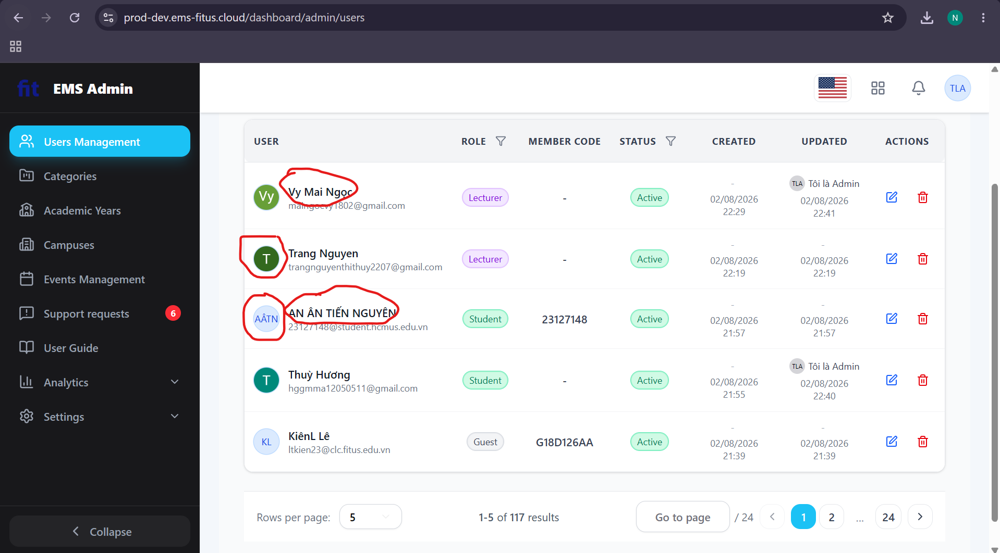 | [Chưa gửi] |
| **USA-02** | C1: Danh sách Users | Usability | Ký tự viết tắt trên avatar không đồng nhất (2-4 ký tự) | Nielsen #4, Nielsen #8, Shneiderman #1 | 2 (Medium) | Chuẩn hóa avatar initials lấy cố định 2 ký tự |  | [Chưa gửi] |
| **USA-03** | C1: Danh sách Users | Usability | Không có breadcrumb để nhận biết phân cấp | Nielsen #1, Nielsen #6, Shneiderman #8 | 2 (Medium) | Thêm breadcrumb "Dashboard > Users Management" | 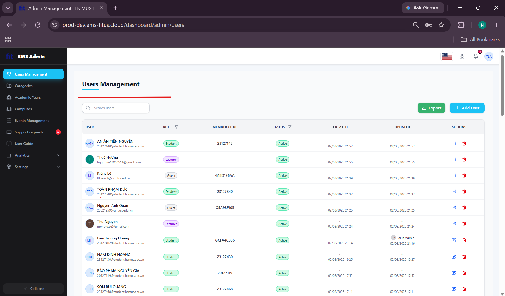 | [Chưa gửi] |
| **USA-04** | C1: Danh sách Users | Usability | Thiếu action quan trọng trên bảng (Block/Unblock, Reset Password) | Nielsen #7, Shneiderman #7 | 2 (Medium) | Thêm dropdown menu "⋮" chứa tất cả các thao tác | 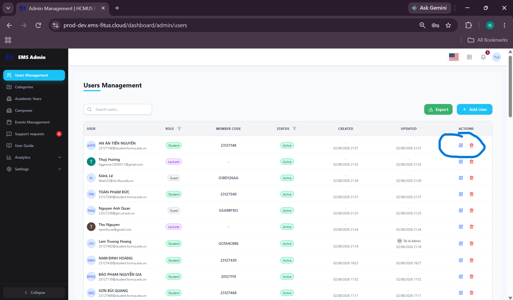 | [Chưa gửi] |
| **USA-05** | C1: Danh sách Users | Usability | Icon Edit và Delete quá nhỏ và nằm sát nhau | Nielsen #5, Shneiderman #5, Norman #3 | 3 (High) | Tăng kích thước (≥ 32px) và khoảng cách giữa các icon |  | [Chưa gửi] |
| **USA-06** | C1: Danh sách Users | Usability | Ô tìm kiếm chỉ có placeholder, không có nhãn (label) | Nielsen #6, Nielsen #10, Shneiderman #8 | 1 (Low) | Thêm label hoặc placeholder rõ ràng hơn |  | [Chưa gửi] |
| **USA-07** | C1: Danh sách Users | Usability | Header bảng thiếu icon biểu thị trạng thái đang sort | Nielsen #1, Nielsen #6, Norman #1 | 2 (Medium) | Thêm icon ↕ (sort ascending/descending) vào cột |  | [Chưa gửi] |
| **USA-08** | C1: Danh sách Users | Usability | Không có checkbox để chọn nhiều user (bulk actions) | Nielsen #7, Shneiderman #7 | 2 (Medium) | Thêm cột checkbox ở đầu mỗi hàng | 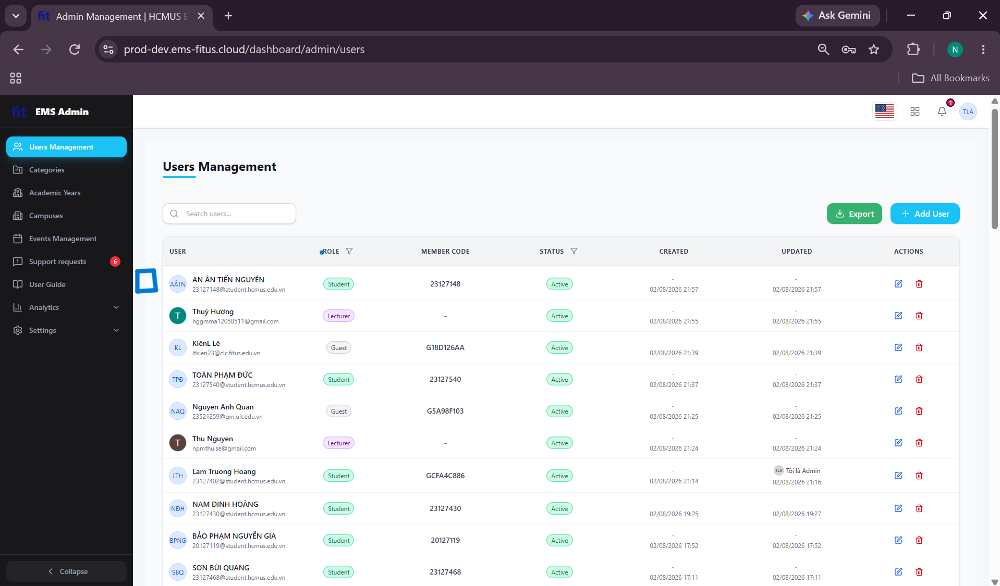 | [Chưa gửi] |
| **USA-09** | C1: Danh sách Users | Usability | Thiếu tooltip khi hover vào email trên bảng | Nielsen #1, Norman #1, Shneiderman #3 | 1 (Low) | Thêm thuộc tính `title` để hiển thị tooltip | 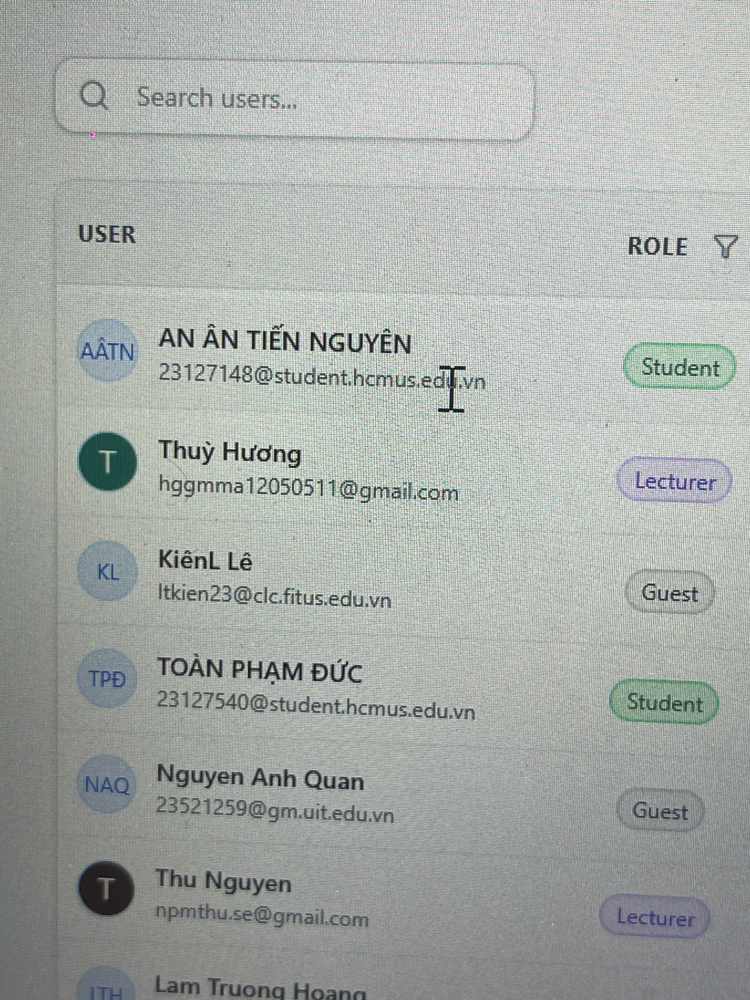 | [Chưa gửi] |
| **USA-10** | C1: Danh sách Users | Usability | Tiêu đề "Users Management" sai ngữ pháp | Nielsen #2, Nielsen #4 | 1 (Low) | Sửa thành "User Management" |  | [Chưa gửi] |
| **USA-11** | C1: Danh sách Users | Usability | Tiêu đề các cột trong bảng dùng dạng ALL CAPS khó đọc | Nielsen #8, Shneiderman #2 | 1 (Low) | Dùng chữ Title Case / Semi-bold cho header | 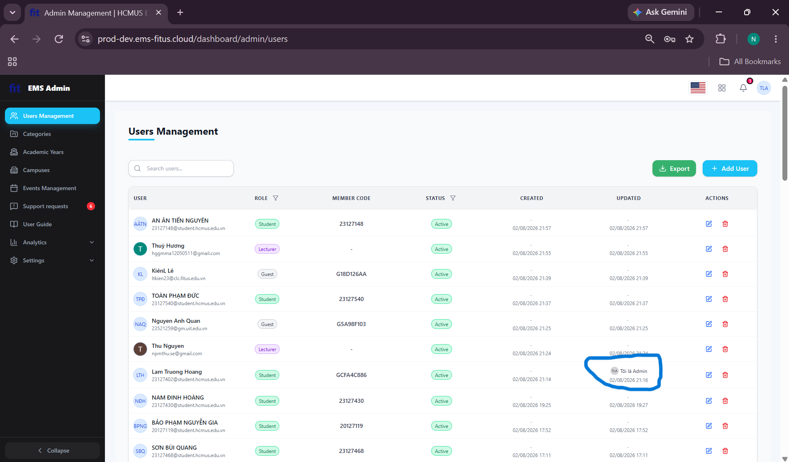 | [Chưa gửi] |
| **USA-12** | C1: Danh sách Users | Usability | Cột CREATED/UPDATED chứa thông tin dư thừa (avatar nhỏ nhòe) | Nielsen #8, Shneiderman #8 | 1 (Low) | Chỉ hiện ngày giờ, đưa avatar vào phần chi tiết | 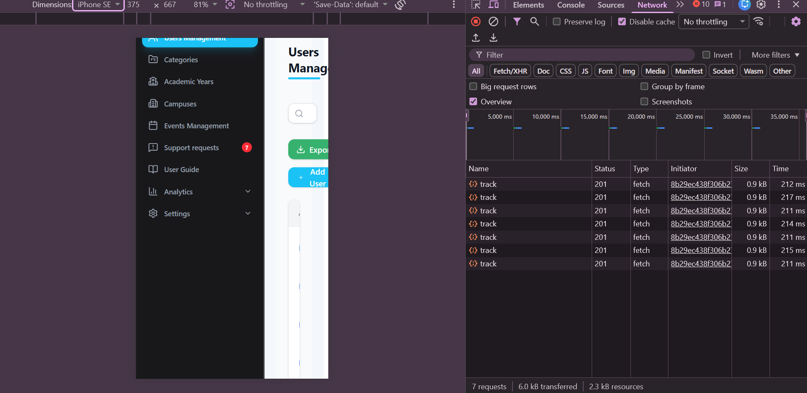 | [Chưa gửi] |
| **USA-13** | C1: Danh sách Users | Usability | Vị trí nút "Add User" dễ bị ẩn khi Responsive mobile | Norman #1, Shneiderman #2 | 1 (Low) | Đổi sang Floating action button (FAB) trên màn nhỏ |  | [Chưa gửi] |
| **BUG-01** | C1: Danh sách Users | Bug | Thanh sidebar không tự động collapse trên màn hình Mobile | Shneiderman #2, Nielsen #7 | 2 (Medium) | Tự động collapse sidebar thành dạng hamburger menu |  | [Chưa gửi] |
| **BUG-02** | C2: Edit User | Bug | Không đánh dấu (*) đỏ cho các trường form bắt buộc | Nielsen #5, Shneiderman #5, Norman #3 | 3 (High) | Thêm dấu * đỏ cho First Name, Email, Role | 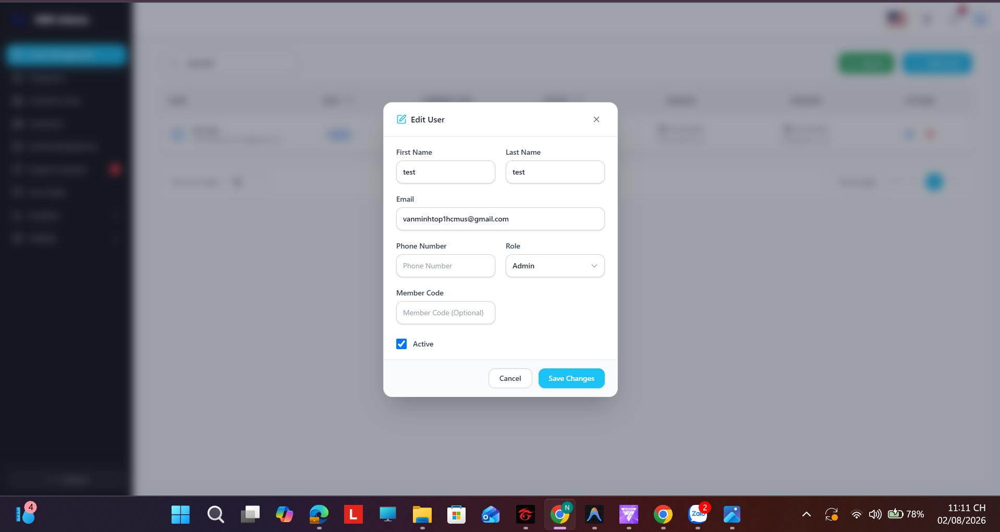 | [Chưa gửi] |
| **BUG-03** | C2: Edit User | Bug | Cho phép thay đổi Email không kèm cảnh báo | Nielsen #5, Shneiderman #5, Norman #3 | 3 (High) | Hiển thị cảnh báo "Ảnh hưởng tài khoản đăng nhập" | 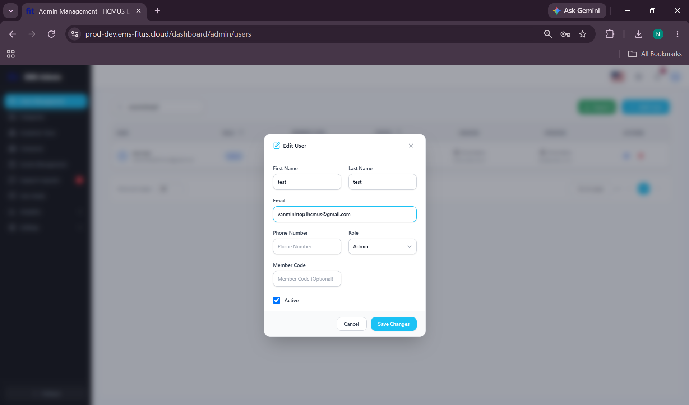 | [Chưa gửi] |
| **BUG-04** | C2: Edit User | Bug | Checkbox Active khi gỡ bỏ không cảnh báo hậu quả | Nielsen #5, Shneiderman #5, Norman #3 | 3 (High) | Cảnh báo: Uncheck sẽ block quyền truy cập user |  | [Chưa gửi] |
| **USA-14** | C2: Edit User | Usability | Dropdown Role thiếu giải thích chi tiết, chưa có confirmation | Nielsen #5, Shneiderman #5, Norman #1 | 2 (Medium) | Thêm giải thích các mức quyền, hiện dialog xác nhận | 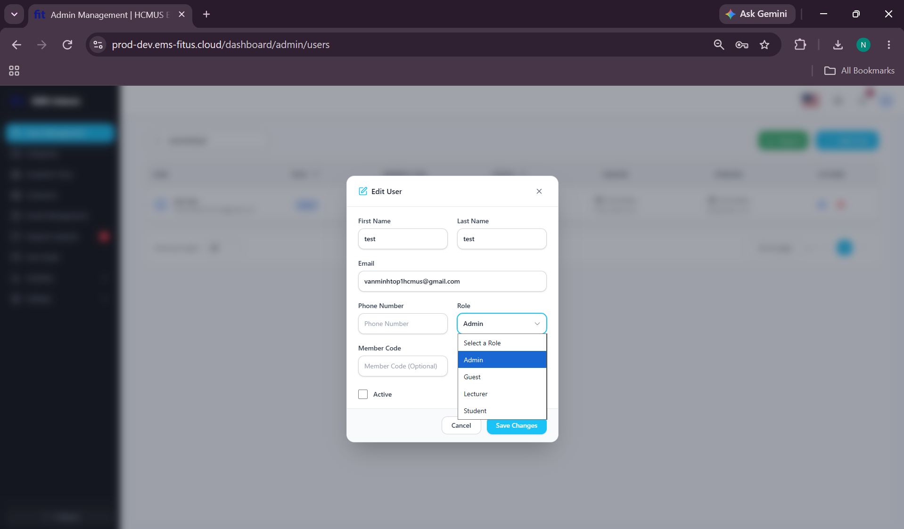 | [Chưa gửi] |
| **USA-15** | C2: Edit User | Usability | Placeholder số điện thoại trùng tên label, thiếu Mask | Nielsen #6, Shneiderman #8 | 2 (Medium) | Sử dụng Input Mask định dạng e.g. 0912... | 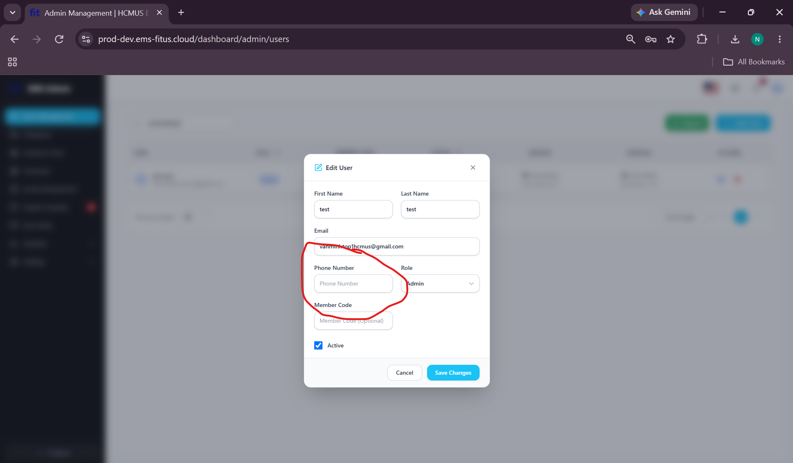 | [Chưa gửi] |
| **USA-16** | C2: Edit User | Usability | Ký hiệu (Optional) bị bỏ vào placeholder và biến mất khi gõ | Nielsen #4, Nielsen #6, Shneiderman #1 | 2 (Medium) | Đưa text _(Optional)_ ra cạnh label của Member Code | 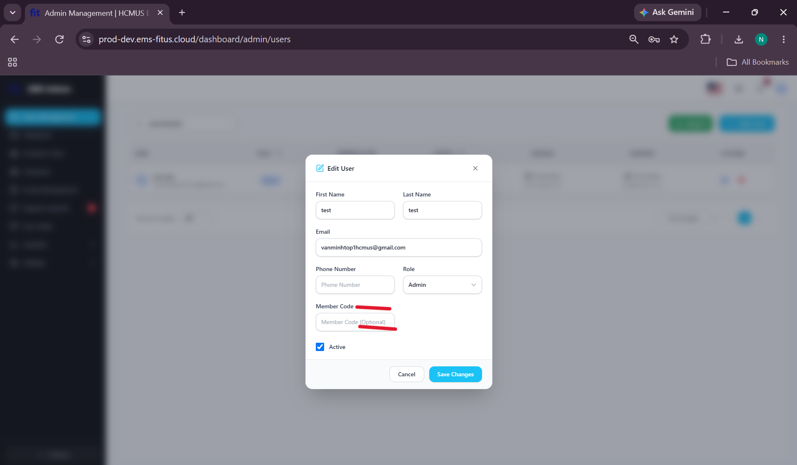 | [Chưa gửi] |
| **BUG-05** | C2: Edit User | Bug | Validation form bị lỗi Map nhầm giữa First và Last Name | Nielsen #9, Shneiderman #3, Norman #2 | 3 (High) | Sửa lại logic bind data cho First Name và Last Name | 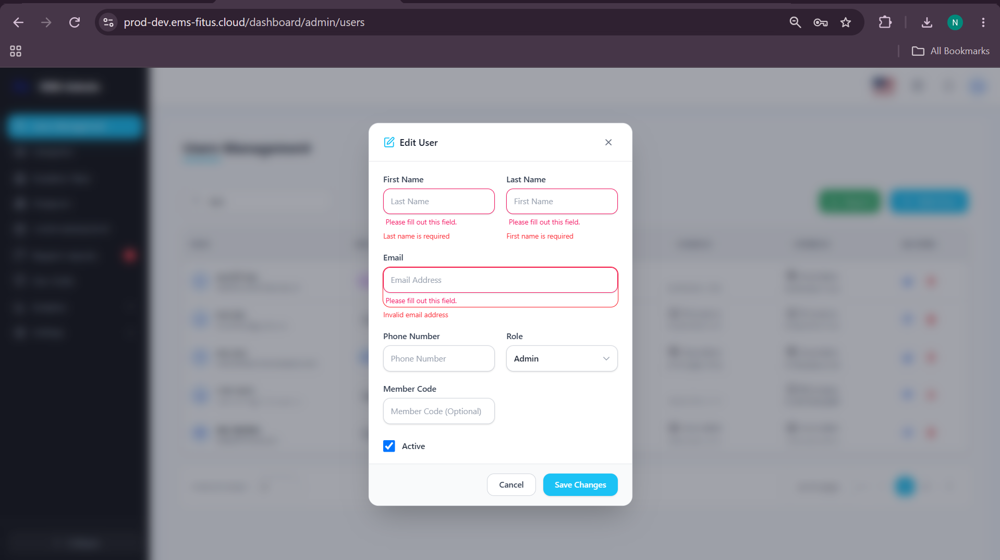 | [Chưa gửi] |
| **USA-17** | C2: Edit User | Usability | Không có thông báo Toast (Thành công) sau khi Save Changes | Nielsen #1, Shneiderman #3, Norman #2 | 2 (Medium) | Hiện Toast xanh góc màn hình báo thành công | 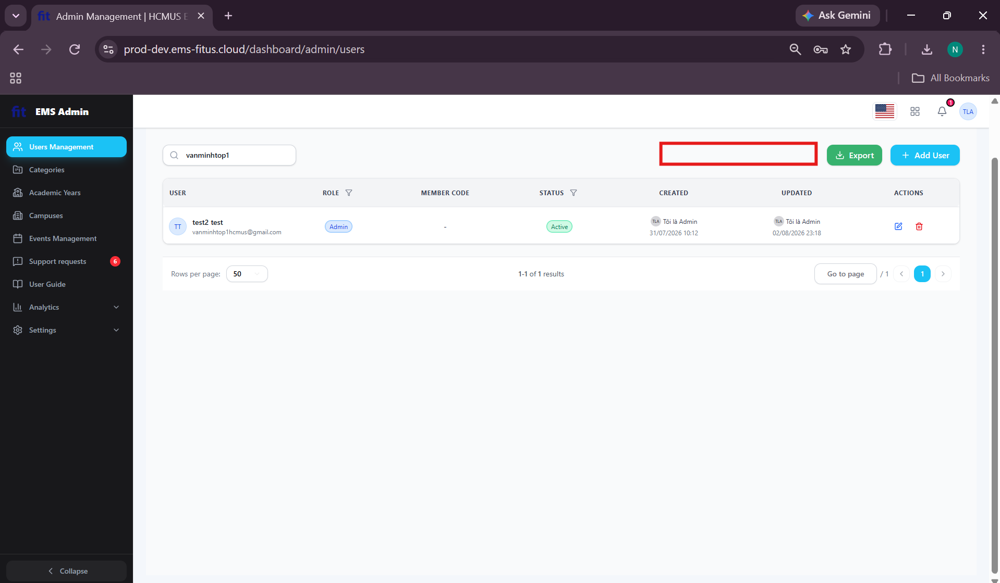 | [Chưa gửi] |
| **USA-18** | C2: Edit User | Usability | Nút Save Changes luôn sáng đèn dù không có thao tác thay đổi gì | Nielsen #5, Nielsen #1, Shneiderman #5 | 1 (Low) | Disable nút Save khi chưa có field nào bị chỉnh sửa | 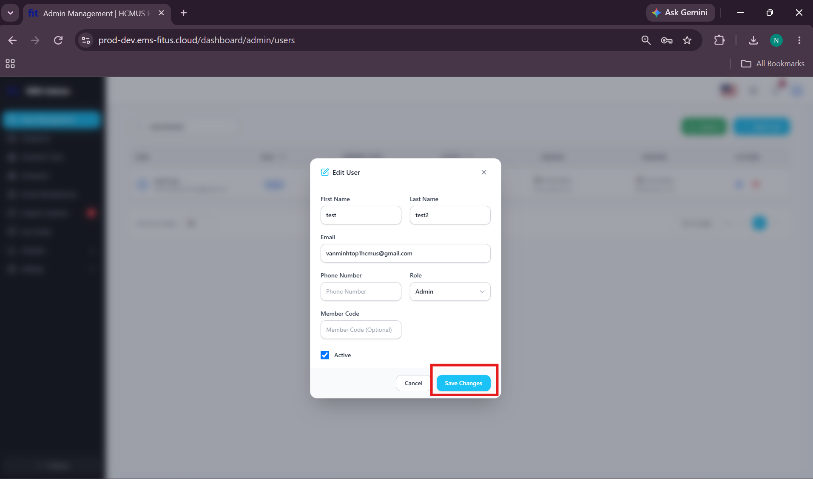 | [Chưa gửi] |
| **USA-19** | C2: Edit User | Usability | Nhấn Cancel không hiển thị popup cảnh báo mất dữ liệu | Nielsen #3, Shneiderman #6, Norman #3 | 2 (Medium) | Hiện modal Warning nếu đang sửa dở và bấm Cancel | 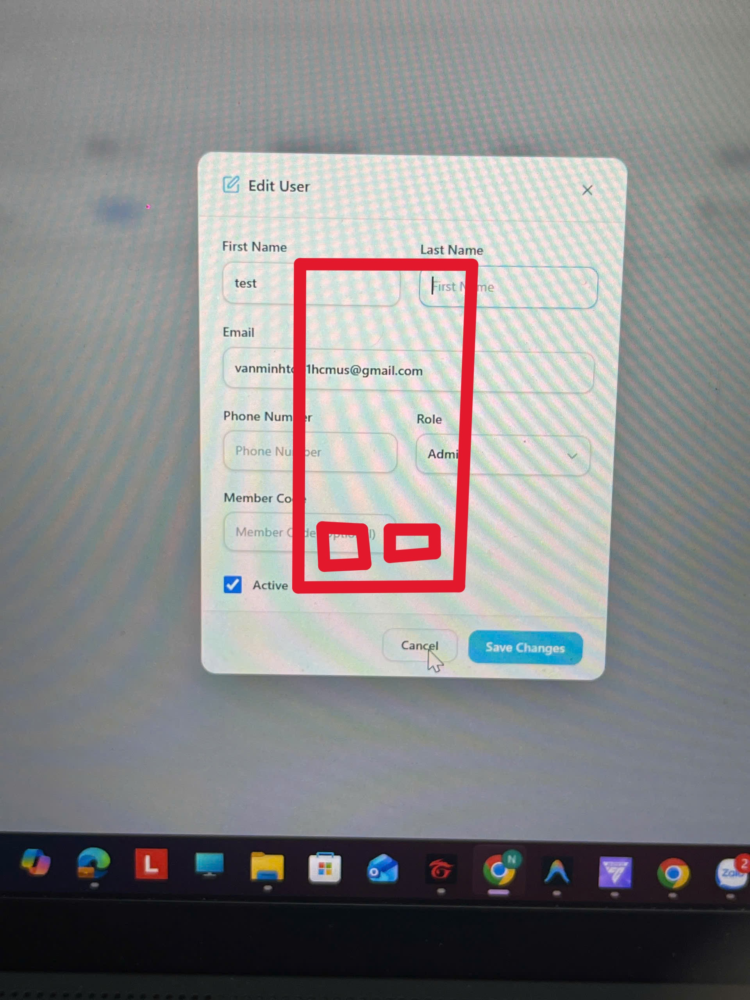 | [Chưa gửi] |
| **USA-20** | C2: Edit User | Usability | Nút đóng (X) đóng ngay lập tức không hỏi Unsaved Changes | Nielsen #3, Shneiderman #6 | 1 (Low) | Đảm bảo nút (X) có cảnh báo như Cancel | 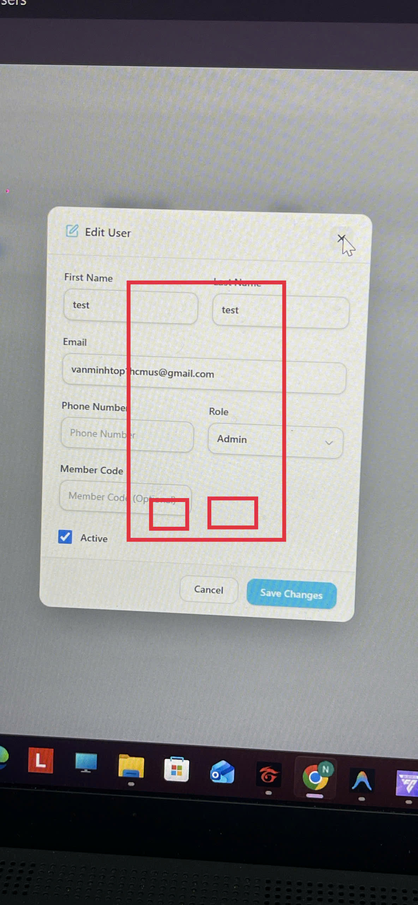 | [Chưa gửi] |
| **USA-21** | C2: Edit User | Usability | Nhấn vào nền (Overlay Blur) có khả năng làm mất dữ liệu | Nielsen #3, Shneiderman #5 | 1 (Low) | Chặn đóng popup khi nhấn ra ngoài lúc có dữ liệu edit | 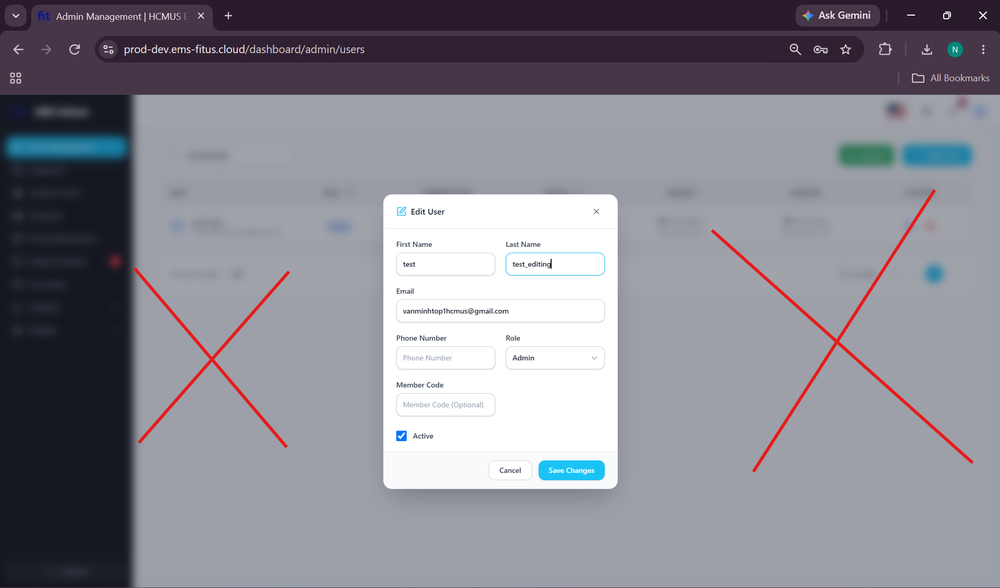 | [Chưa gửi] |
| **USA-22** | C2: Edit User | Usability | Email không validate định dạng on blur (real-time) | Nielsen #9, Shneiderman #3, Norman #2 | 2 (Medium) | Thêm validate email khi người dùng bỏ trỏ chuột | 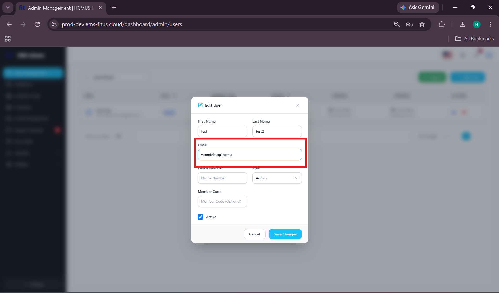 | [Chưa gửi] |
| **USA-23** | C2: Edit User | Usability | Form không Highlight hoặc tóm tắt những trường đã thay đổi | Nielsen #1, Shneiderman #3, Norman #2 | 2 (Medium) | Cần đổi màu viền của input đã thay đổi (Dirty state) | 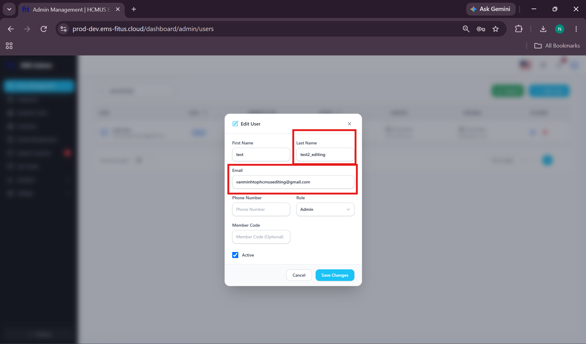 | [Chưa gửi] |
| **USA-24** | C2: Edit User | Usability | Checkbox Active thiếu giải thích phụ (Label description) | Nielsen #2, Nielsen #10 | 1 (Low) | Ghi rõ "User can login" dưới checkbox Active | 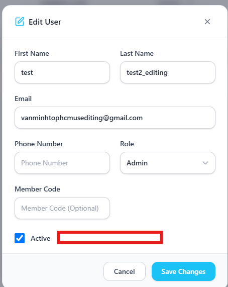 | [Chưa gửi] |
| **BUG-06** | C2: Edit User | Bug | Lỗi Focus Trap khi dùng Tab trên bàn phím lọt ra ngoài Modal | Shneiderman #2, Nielsen #7, WCAG 2.1 | 2 (Medium) | Implement tính năng Focus Trap trên thẻ Modal | 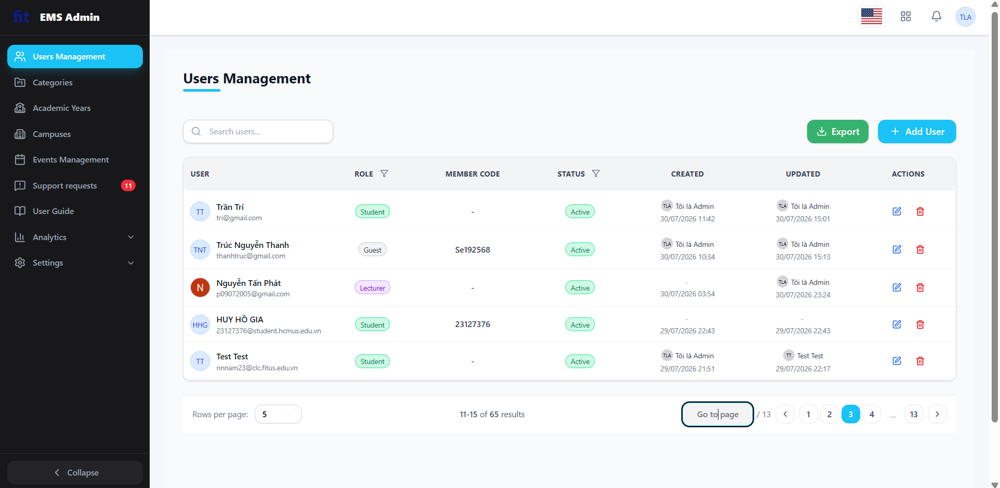 | [Chưa gửi] |
| **USA-25** | C2: Edit User | Usability | Form thiếu audit trail, không có "Last updated by..." | Nielsen #1, Shneiderman #3 | 1 (Low) | Bổ sung timestamp và admin thực hiện lần cuối | 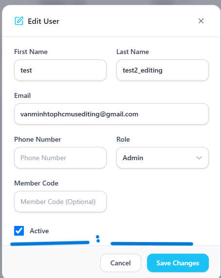 | [Chưa gửi] |
| **BUG-07** | C2: Edit User | Bug | Placeholder First/Last Name đặt ngược nhau | Nielsen #2, Shneiderman #1 | 2 (Medium) | Đổi lại placeholder cho đúng khớp với Label | 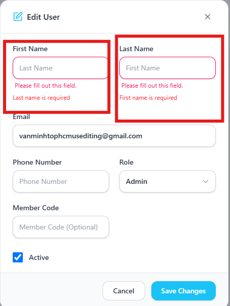 | [Chưa gửi] |
| **USA-26** | C3: Export Users | Usability | Tên file export chứa timestamp quá dài (khó đọc) | Nielsen #2, Shneiderman #8 | 1 (Low) | Đổi sang tên file date tĩnh YYYY-MM-DD | 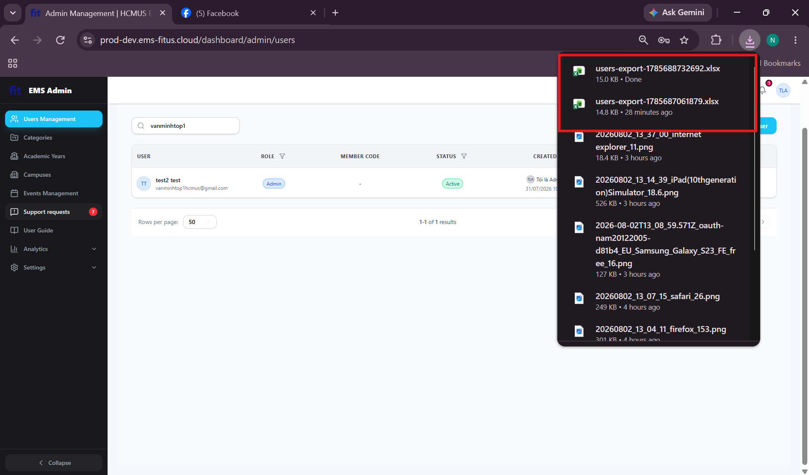 | [Chưa gửi] |
| **USA-27** | C3: Export Users | Usability | Không có Toast, Loading Spinner nào khi nhấn nút Export | Nielsen #1, Norman #2, Shneiderman #3 | 2 (Medium) | Disable nút Export và hiện Loading đến khi có Toast | Không có | [Chưa gửi] |
| **BUG-08** | C3: Export Users | Bug | Header Excel "Card Code" không đồng bộ với Web (Member Code) | Nielsen #4, Norman #4, Shneiderman #1 | 2 (Medium) | Chỉnh sửa Backend/Code Export lại thành "Member Code" | 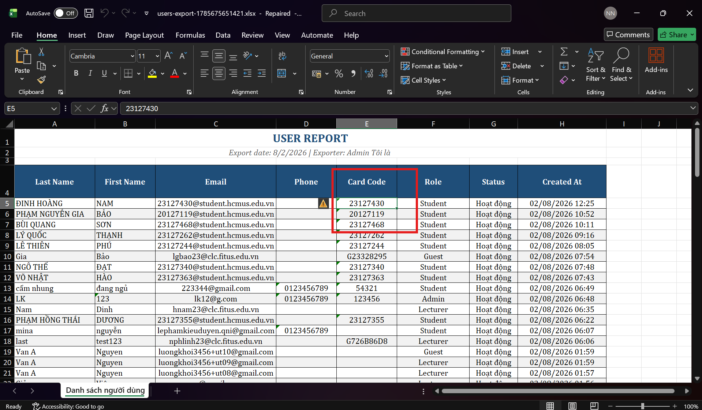 | [Chưa gửi] |
| **BUG-09** | C3: Export Users | Bug | Trộn ngôn ngữ EN/VI trên Status và Header xuất ra file Excel | Nielsen #4, Shneiderman #1 | 2 (Medium) | Mapping cứng ngôn ngữ Status theo ngôn ngữ Web UI | 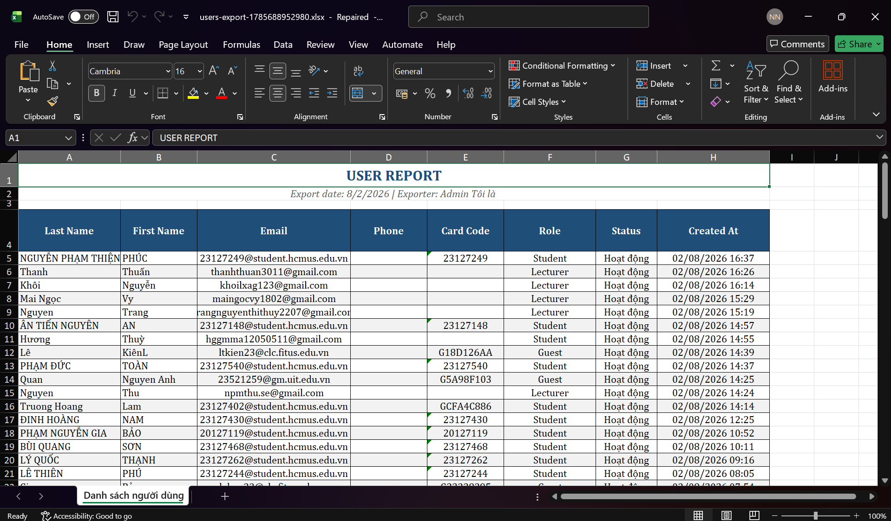 | [Chưa gửi] |
| **USA-28** | C3: Export Users | Usability | Không cho Admin tùy chọn (Export current page/ All / Selected) | Nielsen #3, Nielsen #7, Shneiderman #7 | 2 (Medium) | Bổ sung option popup hỏi người dùng trước khi xuất | Không có | [Chưa gửi] |
| **BUG-10** | C3: Export Users | Bug | Dữ liệu file xuất thiếu cột UPDATED so với Web UI | Nielsen #4, Shneiderman #1 | 1 (Low) | Yêu cầu BE bổ sung thêm property Updated | 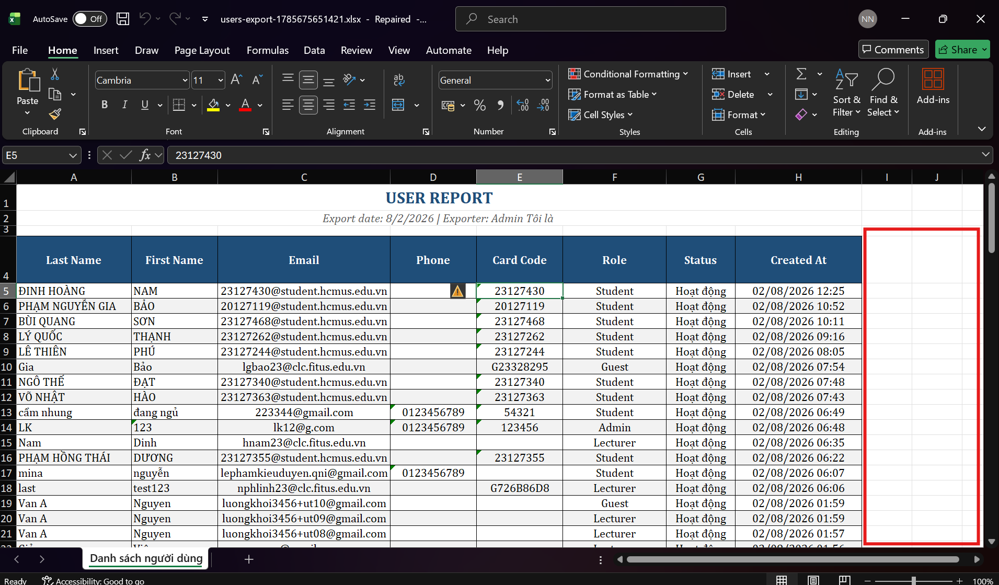 | [Chưa gửi] |
| **USA-29** | C3: Export Users | Usability | Trình duyệt Offline nhưng nút Export không thông báo | Nielsen #1 | 1 (Low) | Bắt sự kiện mạng (offline) và hiện banner đỏ | Không có | [Chưa gửi] |
| **BUG-11** | Task 2 (Usability) | Bug | File Excel tải về không mở được (Bị hỏng/Corrupt) | Thử nghiệm người dùng (P3) | 3 (High) | Fix thư viện export (vd: xlsx, exceljs) tránh corrupt |  | [Chưa gửi] |
| **USA-30** | Task 2 (Usability) | Usability | Admin Dashboard khó tìm kiếm đối với người dùng mới | Thử nghiệm người dùng (P1) | 2 (Medium) | Đặt lại vị trí icon Menu Dashboard nổi bật hơn |  | [Chưa gửi] |
| **USA-31** | Task 2 (Usability) | Usability | Quy trình phân quyền user chưa hiệu quả (rườm rà) | Thử nghiệm người dùng (P4) | 1 (Low) | Tích hợp Bulk Action (Sửa hàng loạt) hoặc Inline Edit | Không có | [Chưa gửi] |
| **BUG-12** | Task 3 (Cross-Browser) | Bug | Giao diện trắng (White screen) lỗi hoàn toàn trên Internet Explorer 11 (Win 10) | IE11 Compatibility | 4 (Critical) | Thay thế các thư viện JS không hỗ trợ hoặc chặn cảnh báo | 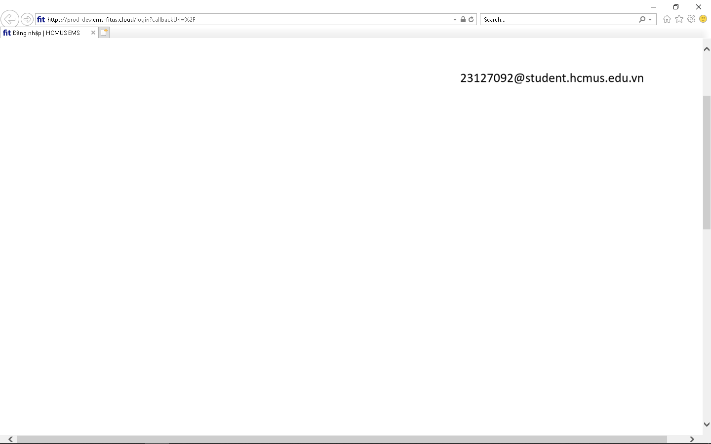 | [Chưa gửi] |
| **BUG-13** | Task 3 (Cross-Browser) | Bug | Giao diện nát, vỡ layout trầm trọng trên Chrome Android Phone | Mobile Android Chrome | 4 (Critical) | Code lại cấu trúc Responsive (Media query) cho Mobile | 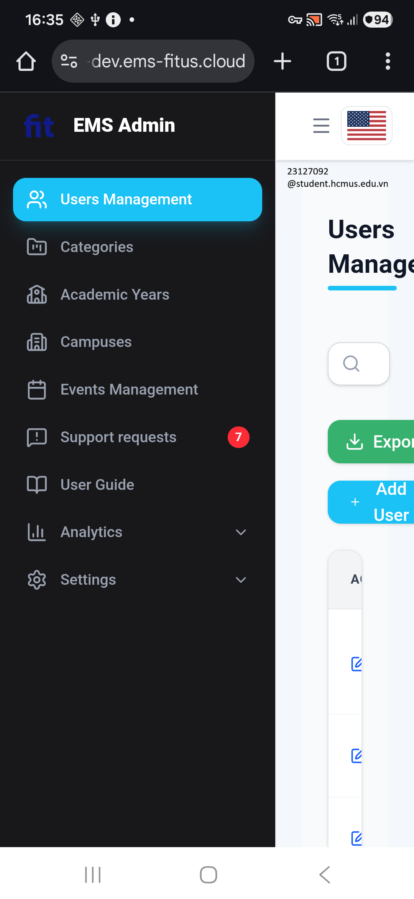 | [Chưa gửi] |
| **BUG-14** | Task 3 (Cross-Browser) | Bug | Hàng số trang bị tràn, phải cuộn trang theo chiều ngang trên Safari (iOS iPad) | Safari iOS Tablet | 2 (Medium) | Sửa lại flex-wrap hoặc kích thước div Pagination | 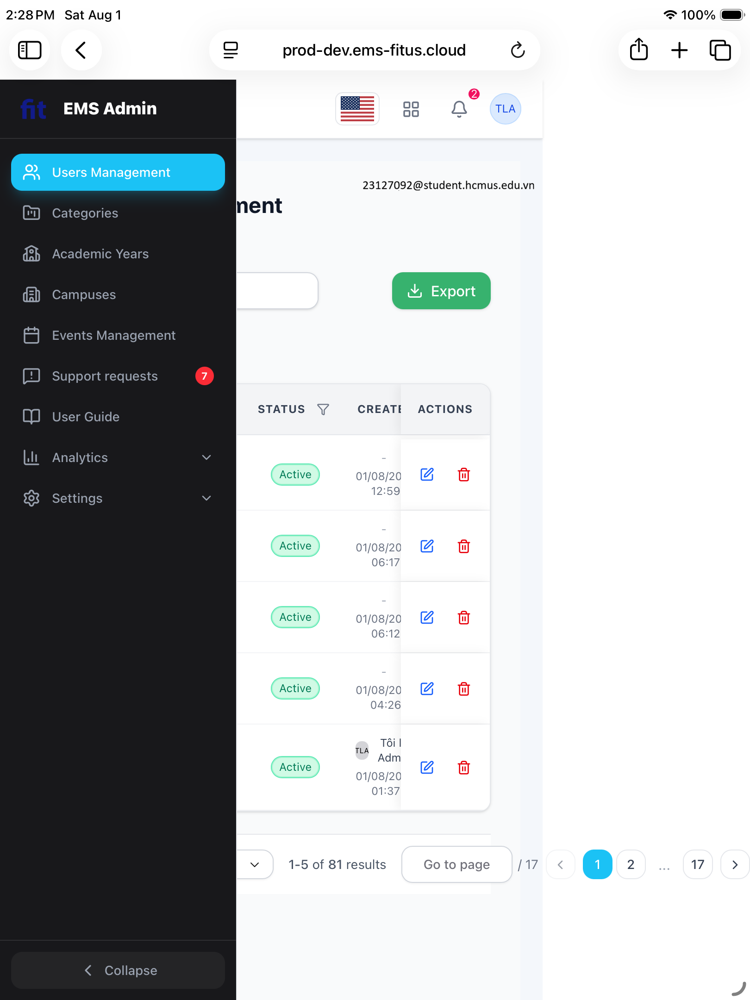 | [Chưa gửi] |
