# BÁO CÁO CHÍNH - HW03 GUI & USABILITY TESTING

## 1. Thông tin chung

# Báo cáo Tổng kết - Kịch bản Quản lý Người dùng (EMS)

## Thông tin Dự án

- **Kịch bản đã chọn:** Kịch bản C (Admin quản lý người dùng / Users Management).
- **Các màn hình đã kiểm tra:**
  - Màn hình C1: Danh sách Users
  - Màn hình C2: Edit User / Assign Role (Popup/Modal)
  - Màn hình C3: Export Users (File Excel sinh ra)

## Tóm tắt Số liệu Kiểm thử (Test Summary)

### Task 1: Kiểm thử Heuristic (GUI & Usability)

- **Số mục checklist thiết kế:** ~47 mục (ước lượng các ID từ GUI-01 đến GUI-47).
- **Số mục đã chạy đánh giá:** 45 mục (được áp dụng vào màn C1, C2, C3).
- **Số mục Pass:** 14 mục.
- **Số mục Fail / Partial:** 30 mục (25 Fail, 5 Partial).
- **Tổng số lỗi (Bug/Usability) tìm thấy:** 45 vấn đề

### Task 2: Usability Testing

- **Số người tham gia user-testing:** 5 người (P1 - P5).
- **Số vấn đề usability phát hiện:**
  - 1 vấn đề Nghiêm trọng cao (High) - Liên quan lỗi xuất Excel hỏng.
  - 1 vấn đề Trung bình (Medium) - Vị trí Admin Dashboard khó tìm.
  - 1 vấn đề Thấp (Low) - Quy trình phần quyền còn rườm rà.

### Task 3: Cross-browser & Platform Compatibility

- **Số ô tương thích đã phủ:** 18 ca kiểm thử (3 màn hình × 6 tổ hợp thiết bị/trình duyệt).
- **Kết quả chung:** Website hoạt động ổn định trên các nền tảng WebKit/Blink Desktop (Edge, Chrome, Safari macOS, Firefox), nhưng gặp lỗi nghiêm trọng trên các thiết bị Mobile (Chrome Android) và trình duyệt cũ (IE 11).

## Video Demo

[https://youtu.be/AR2RLUP8oq8]

## Bảng tự đánh giá (Self-Assessment)

| **STT** | **Tiêu chí**                                                                                    | **Điểm** | **Tự đánh giá** |
| ------- | ----------------------------------------------------------------------------------------------- | -------- | --------------- |
| **1a**  | Task 1A — Checklist dùng chung (> 40 mục, IA-01…IA-04) + nguồn tham khảo + prompt AI _(nhóm)_   | 15       | 15              |
| **1b**  | Task 1B — Chạy checklist trên ≥ 3 màn hình + bug report _(cá nhân)_                             | 15       | 15              |
| **2**   | Task 2 — User testing với 5 người dùng thật (kịch bản + 5 phiên + phân tích → Usability Report) | 25       | 25              |
| **3**   | Task 3 — Ma trận Cross-Browser / Cross-Platform (3 OS × 5 browser × 3 loại thiết bị)            | 25       | 25              |
| **4**   | Nộp Bug & Usability Findings (Google Form) + log tổng hợp                                       | 10       | 10              |
| **5**   | Agent Skills                                                                                    | 10       | 10              |
|         | **Tổng**                                                                                        | **100**  | **100**         |

## 2. Phân tích GUI & Usability (Task 1)

# Phân tích GUI & Usability — Màn hình C1: Danh sách Users (User List)

> **Kịch bản C — Admin quản lý người dùng**
> Phân tích dựa trên: 10 Heuristics (Nielsen), 6 Principles (Norman), 8 Golden Rules (Shneiderman)
> Đối chiếu với [GUI_Checklist_EMS.md](GUI_Checklist_EMS.md)

---

## 1. Mô tả màn hình

Trang **Users Management** phía Admin gồm các thành phần chính:

- **Sidebar trái** (dark navy): menu điều hướng với "Users Management" đang active (highlight xanh dương)
- **Header**: logo "EMS Admin", cờ US (ngôn ngữ), icon grid, icon chuông (notification), avatar user "TLA"
- **Vùng nội dung chính**:
  - Tiêu đề "Users Management" với underline xanh
  - Thanh tìm kiếm "Search users..."
  - 2 nút: **Export** (xanh lá) và **+ Add User** (xanh dương)
  - Bảng dữ liệu: cột USER, ROLE, MEMBER CODE, STATUS, CREATED, UPDATED, ACTIONS
  - 5 hàng dữ liệu user
- **Pagination**: "Rows per page: 5", "1-5 of 50 results", điều hướng trang (1, 2, ..., 10)

---

## 2. Bảng phát hiện vấn đề (Findings)

| #   | Vị trí trên màn hình                       | Vấn đề cụ thể                                                                                                                                                                                                                                         | Heuristic / Nguyên tắc bị vi phạm                                                                                                                 | Mức nghiêm trọng (0–4) | Đề xuất sửa                                                                                                                                                                                                                    | Checklist ID   |
| --- | ------------------------------------------ | ----------------------------------------------------------------------------------------------------------------------------------------------------------------------------------------------------------------------------------------------------- | ------------------------------------------------------------------------------------------------------------------------------------------------- | ---------------------- | ------------------------------------------------------------------------------------------------------------------------------------------------------------------------------------------------------------------------------ | -------------- |
| 1   | Cột **USER**                               | Tên user hiển thị không đồng nhất: có dòng dùng **ALL CAPS** (như "TRÍ ĐỖ NGUYỄN MINH"), có dòng lại dùng Title Case ("Lâm Hoàng"). Gây mất thẩm mỹ và thiếu tính chuyên nghiệp.                                                                      | **Nielsen #4** (Consistency & Standards), **Shneiderman #1** (Consistency)                                                                        | **2**                  | Chuẩn hóa cách hiển thị tên: luôn dùng Title Case (`text-transform: capitalize`) hoặc giữ nguyên như user nhập nhưng phải validate khi đăng ký.                                                                                | GUI-02, GUI-04 |
| 2   | Cột **USER**, avatar initials              | Ký tự viết tắt trên avatar không đồng nhất về số lượng (từ 2 đến 4 ký tự), dẫn đến hiển thị lộn xộn, thiếu sự nhất quán trong giao diện.                                                                                                              | **Nielsen #4** (Consistency & Standards), **Nielsen #8** (Aesthetic & Minimalist Design), **Shneiderman #1** (Consistency)                        | **2**                  | Chuẩn hóa avatar initials: luôn lấy cố định **2 ký tự** (chữ cái đầu của Họ + Tên).                                                                                                                                            | GUI-10         |
| 3   | **Toàn trang** — Breadcrumb                | **Không có breadcrumb** hiển thị đường dẫn phân cấp (VD: "Admin > Users Management"). User không biết mình đang ở đâu trong cấu trúc site ngoài việc nhìn sidebar.                                                                                    | **Nielsen #1** (Visibility of System Status), **Nielsen #6** (Recognition Rather Than Recall), **Shneiderman #8** (Reduce Short-Term Memory Load) | **2**                  | Thêm breadcrumb ngay dưới header, trên tiêu đề trang: `Dashboard > Users Management`. Mỗi node có thể click để quay lại.                                                                                                       | GUI-28         |
| 4   | Cột **ACTIONS**                            | Chỉ có 2 icon action: Edit (xanh) và Delete (đỏ). **Thiếu các action quan trọng** cho quản trị user: Block/Unblock, Reset Password, View Detail, Assign Role. Admin phải click Edit mới truy cập được → tốn thêm bước.                                | **Nielsen #7** (Flexibility & Efficiency), **Shneiderman #7** (Keep Users in Control)                                                             | **2**                  | Thêm icon action cho Block/Unblock, Reset Password trực tiếp trên hàng; hoặc dùng dropdown menu "⋮" (more actions) chứa tất cả action phụ.                                                                                     | GUI-09, GUI-11 |
| 5   | Cột **ACTIONS** — icon Edit và Delete      | 2 icon action **quá nhỏ** (~20×20px) và **đặt sát nhau** (khoảng cách ~10px). Dễ bấm nhầm Delete thay vì Edit, đặc biệt trên thiết bị cảm ứng. Vi phạm **Fitts' Law** — target quá nhỏ cho hành động có hậu quả khác nhau lớn.                        | **Nielsen #5** (Error Prevention), **Shneiderman #5** (Prevent Errors), **Norman #3** (Constraints)                                               | **3**                  | Tăng kích thước icon action (≥ 32×32px). Tăng khoảng cách giữa Edit và Delete (≥ 16px). Cân nhắc tách Delete ra khỏi hàng actions trực tiếp, đưa vào dropdown menu hoặc yêu cầu chọn trước (checkbox) rồi mới hiện nút Delete. | GUI-11, GUI-38 |
| 6   | Thanh tìm kiếm **"Search users..."**       | Thanh search chỉ có placeholder, **không có label** phía trên hoặc bên cạnh. Khi focus vào ô, placeholder biến mất → user không nhớ trường này dùng để tìm gì (tìm theo tên? email? member code?). Không có hướng dẫn phạm vi tìm kiếm.               | **Nielsen #6** (Recognition Rather Than Recall), **Nielsen #10** (Help & Documentation), **Shneiderman #8** (Reduce Short-Term Memory Load)       | **1**                  | Giữ placeholder chi tiết hơn: "Search by name, email or member code…". Hoặc thêm label/hint text bên ngoài ô search. Thêm nút clear (×) khi có text trong ô.                                                                   | GUI-14, GUI-24 |
| 7   | **Header bảng** — Các cột                  | Các cột **không có chỉ báo sort** (sort indicator ↑↓). Không rõ bảng đang sắp xếp theo gì, và cột nào có thể click để sort. User phải thử click từng header để xem có sort được không.                                                                | **Nielsen #1** (Visibility of System Status), **Nielsen #6** (Recognition Rather Than Recall), **Norman #1** (Visibility)                         | **2**                  | Thêm icon ↕ (sort ascending/descending) trên mỗi cột sortable. Cột đang sort active hiển thị ↑ hoặc ↓. Cursor đổi thành pointer khi hover lên header sortable.                                                                 | GUI-09         |
| 8   | **Bảng dữ liệu** — Toàn bộ                 | **Không có checkbox** ở mỗi hàng để chọn nhiều user. Admin không thể thực hiện bulk actions (block nhiều user, export user đã chọn, assign role hàng loạt). Phải thao tác từng user một.                                                              | **Nielsen #7** (Flexibility & Efficiency), **Shneiderman #7** (Keep Users in Control)                                                             | **2**                  | Thêm cột checkbox ở đầu mỗi hàng + checkbox "Select All" ở header. Khi chọn ≥ 1 user, hiện action bar floating: "3 selected — [Block] [Export] [Assign Role] [Delete]".                                                        | GUI-07         |
| 9   | Cột **USER** — Email                       | Thiếu tooltip cho email: Dù email đang hiển thị đủ trên màn hình rộng, nhưng **không có tooltip** hiển thị đầy đủ khi hover. Trên màn hình nhỏ, nếu email bị cắt (text-overflow) admin sẽ không xem được.                                             | **Nielsen #1** (Visibility of System Status), **Norman #1** (Visibility), **Shneiderman #3** (Informative Feedback)                               | **1**                  | Thêm tooltip (`title` attribute) hiển thị email đầy đủ khi hover. Dùng `text-overflow: ellipsis` có kiểm soát, kèm tooltip. Hoặc cho phép expand hàng khi click.                                                               | GUI-05         |
| 10  | **Tiêu đề trang**                          | "**Users Management**" — ngữ pháp tiếng Anh không chuẩn. Đúng phải là "**User Management**" (danh từ ghép dùng số ít) theo convention phổ biến (giống "Event Management", "Order Management").                                                        | **Nielsen #2** (Match Between System & Real World), **Nielsen #4** (Consistency & Standards)                                                      | **1**                  | Sửa thành "User Management" (số ít) cho đúng ngữ pháp tiếng Anh. Hoặc nếu dùng đa ngôn ngữ, đảm bảo bản dịch tiếng Việt cũng chính xác: "Quản lý người dùng".                                                                  | GUI-08         |
| 11  | **Header bảng** — Typography               | Header bảng dùng **ALL CAPS** ("USER", "ROLE", "MEMBER CODE", "STATUS", "CREATED", "UPDATED", "ACTIONS"). Nghiên cứu typography cho thấy ALL CAPS **giảm tốc độ đọc ~13-20%** vì mất hình dạng chữ (word shape).                                      | **Nielsen #8** (Aesthetic & Minimalist Design), **Shneiderman #2** (Universal Usability)                                                          | **1**                  | Chuyển sang **Title Case** ("User", "Role", "Member Code") hoặc **Sentence case** ("User", "Role", "Member code"). Dùng font-weight: 600 (semi-bold) thay vì CAPS để phân biệt header với data.                                | GUI-02         |
| 12  | **Cột CREATED & UPDATED** — Thông tin thừa | Cột UPDATED (ở một số dòng) có hiển thị avatar nhỏ + "Tôi là Admin" + ngày giờ. Avatar nhỏ trong ô bảng (~16px) **gần như không nhận diện được**, chỉ thêm noise thị giác. Thông tin "ai tạo/sửa" hiếm khi cần xem trên list view.                    | **Nielsen #8** (Aesthetic & Minimalist Design), **Shneiderman #8** (Reduce Short-Term Memory Load)                                                | **1**                  | Chỉ hiển thị ngày giờ trên list view. Đưa thông tin "Created by / Updated by" vào trang detail hoặc tooltip khi hover. Giảm clutter cho bảng.                                                                                  | GUI-04         |
| 13  | **Nút "Add User"** — vị trí                | Nút **"+ Add User"** nằm ở **góc trên phải**, cùng hàng với ô Search. Trên màn hình nhỏ, nút này có thể bị ẩn hoặc xuống hàng mới. Ngoài ra, không rõ nút này tạo user mới trực tiếp hay mở form riêng.                                               | **Norman #1** (Visibility), **Shneiderman #2** (Universal Usability)                                                                              | **1**                  | Đảm bảo nút Add User luôn hiển thị trên mọi viewport. Cân nhắc đặt floating action button (FAB) trên mobile. Text nút nên ghi rõ: "+ Add New User".                                                                            | GUI-05, GUI-11 |
| 14  | **Toàn trang** — Keyboard accessibility    | (Đã kiểm chứng thực tế: PASS) Focus ring di chuyển logic, hiển thị rõ ràng, phím Enter kích hoạt được các action icons bình thường. Không phát hiện lỗi accessibility cơ bản.                                                                         | **Shneiderman #2** (Universal Usability), **Nielsen #7** (Flexibility & Efficiency), **WCAG 2.1**                                                 | **0**                  | Không cần sửa (tính năng hoạt động đúng kỳ vọng).                                                                                                                                                                              | GUI-12         |
| 15  | **Responsive** — Sidebar & Bảng            | Khi thu nhỏ màn hình, bảng xuất hiện thanh cuộn ngang (chống vỡ layout tốt). Tuy nhiên, sidebar không tự động collapse để nhường không gian cho nội dung, dù icon hamburger (≡) đã xuất hiện.    | **Shneiderman #2** (Universal Usability), **Nielsen #7** (Flexibility & Efficiency)                                                               | **2**                  | Tự động collapse sidebar thành dạng icon hoặc ẩn hẳn vào hamburger menu khi kích thước màn hình nhỏ.                                                                                                                           | GUI-05, GUI-33 |

---

## 3. Đối chiếu Checklist — Kết quả chạy trên màn hình C1

| Checklist ID | Tên tiêu chí             | Kết quả     | Ghi chú                                                                                                                                                                                                         |
| ------------ | ------------------------ | ----------- | --------------------------------------------------------------------------------------------------------------------------------------------------------------------------------------------------------------- |
| GUI-01       | Layout nhất quán         | **Passed**  | Sidebar, header, content area giữ đúng vị trí.                                                                                                                                                                  |
| GUI-02       | Typography nhất quán     | **Failed**  | ALL CAPS header bảng; tên user không nhất quán (CAPS vs Title Case). Xem #1, #10. Xem #1, #10, #10. Xem #1, #10, #10. Xem #1, #10. Xem #1, #10.                                                                 |
| GUI-03       | Bảng màu nhất quán       | **Passed**  | Màu sắc các nút (Add xanh dương, Export xanh lá, Delete đỏ) nhất quán với ngữ nghĩa.                                                                                                                            |
| GUI-04       | Canh lề & Spacing        | **Partial** | Layout tổng thể OK, nhưng cột CREATED/UPDATED có quá nhiều thông tin chen chúc. Xem #1, #10, #19. Xem #1, #10, #18. Xem #1, #10, #10. Xem #1, #10, #10.                                                         |
| GUI-05       | Responsive design        | **Partial** | Bảng có thanh cuộn ngang chống vỡ layout, nhưng sidebar không tự động collapse. Xem #10, #18, #21. Xem #9, #10, #20. Xem #9, #10, #19. Xem #9, #10, #10.                                                        |
| GUI-06       | Empty state              | **Passed**  | Bảng hiển thị thông báo rõ ràng "No users found matching your filters." khi không có dữ liệu.                                                                                                                   |
| GUI-07       | Loading state            | **Passed**  | Hệ thống hiển thị spinner khi chuyển trang, báo hiệu rõ ràng trạng thái tải dữ liệu. Xem #8.                                                                                                                    |
| GUI-08       | i18n EN/VI               | **Failed**  | Tiêu đề "Users Management" sai ngữ pháp. Xem #10.                                                                                                                                                               |
| GUI-09       | Icon rõ ràng & nhất quán | **Failed**  | thiếu sort icon trên cột; thiếu action icons cho Block/Reset. Xem #4, #7, #10. Xem #4, #8. Xem #4, #7. Xem #4, #7. Xem #4, #7.                                                                                  |
| GUI-10       | Avatar hiển thị đúng     | **Failed**  | Avatar initials không nhất quán (2-4 ký tự), chữ bị nhỏ khó đọc. Xem #2.                                                                                                                                        |
| GUI-11       | Button states            | **Passed**  | Các nút có hiệu ứng đổi màu khi hover báo hiệu click được (dù không hiện icon bàn tay). Vẫn lưu ý icon action nhỏ (#5). Xem #4, #5, #18, #19. Xem #4, #5, #10, #18. Xem #4, #5, #10, #10. Xem #4, #5, #10, #10. |
| GUI-12       | Keyboard navigation      | **Passed**  | Hệ thống hỗ trợ điều hướng bằng phím Tab logic (focus ring rõ ràng) và phím Enter kích hoạt được action icons. Xem #10, #20. Xem #10, #19. Xem #10, #18. Xem #10, #10.                                          |
| GUI-13       | ARIA & Heading           | **Passed**  | Kiểm tra mã HTML bằng DevTools cho thấy icon action (như Edit) có thuộc tính `aria-label="Edit user"`, hỗ trợ tốt cho trình đọc màn hình.                                                                       |
| GUI-14       | Label form field         | **Failed**  | Ô search chỉ có placeholder, không có label visible. Xem #6.                                                                                                                                                    |
| GUI-22       | **Passed**               | **Failed**  | Filter ROLE/STATUS hoạt động trực tiếp qua icon trên header cột.                                                                                                                                                |
| GUI-24       | Placeholder ≠ Label      | **Failed**  | Search box dùng placeholder "Search users..." thay cho label. Xem #6.                                                                                                                                           |
| GUI-27       | Sidebar active state     | **Passed**  | "Users Management" được highlight xanh dương, rõ ràng. Xem #10.                                                                                                                                                 |
| GUI-28       | Breadcrumb               | **Failed**  | Không có breadcrumb. Xem #3.                                                                                                                                                                                    |
| GUI-32       | **Passed**               | **Partial** | Có phân trang hiển thị số dòng rõ ràng, cung cấp đủ tùy chọn rows per page.                                                                                                                                     |
| GUI-33       | Sidebar collapse/expand  | **Failed**  | Sidebar không tự collapse trên màn hình nhỏ dù đã có icon hamburger. Xem #10.                                                                                                                                   |
| GUI-39       | Màu trạng thái           | **Passed**  | Status "Active" badge màu xanh lá phù hợp quy ước. (Cần verify Blocked state.)                                                                                                                                  |
| GUI-41       | Badge/counter            | **Passed**  | Support requests có badge đỏ "7" trên sidebar.                                                                                                                                                                  |

---

## 4. Tổng hợp theo mức nghiêm trọng

| Mức nghiêm trọng      | Mô tả                   | Số vấn đề | Finding #                      |
| --------------------- | ----------------------- | --------- | ------------------------------ |
| **4 — Catastrophe**   | Usability catastrophe   | **0**     | —                              |
| **3 — Major**         | Major usability problem | **1**     | #5 (Action icons nhỏ sát nhau) |
| **2 — Minor**         | Minor usability problem | **6**     | #1, #2, #3, #4, #7, #8, #10    |
| **1 — Cosmetic**      | Cosmetic problem only   | **7**     | #6, #9, #9, #11, #12, #13      |
| **0 — Not a problem** | Not a usability problem | **1**     | #10                            |

---

## 5. Tổng hợp theo Interface Aspect (IA)

| Aspect                       | Findings liên quan                     | Số lượng |
| ---------------------------- | -------------------------------------- | -------- |
| **IA-01** — Chuẩn UI chung   | #1, #2, #7, #9, #9, #11, #12, #14, #15 | 9        |
| **IA-02** — Forms            | #6                                     | 2        |
| **IA-03** — Navigation       | #3, #4, #10                            | 6        |
| **IA-04** — Feedback / State | #5, #8, #10                            | 3        |

---

## 6. Tổng hợp theo Nguyên tắc bị vi phạm nhiều nhất

| Nguyên tắc                                         | Số lần vi phạm |
| -------------------------------------------------- | -------------- |
| **Nielsen #4** — Consistency & Standards           | 5              |
| **Nielsen #6** — Recognition Rather Than Recall    | 2              |
| **Shneiderman #1** — Strive for Consistency        | 4              |
| **Shneiderman #8** — Reduce Short-Term Memory Load | 2              |
| **Nielsen #7** — Flexibility & Efficiency          | 4              |
| **Norman #1** — Visibility                         | 4              |
| **Nielsen #1** — Visibility of System Status       | 3              |
| **Shneiderman #2** — Seek Universal Usability      | 3              |

---

## 7. Kết luận

Trang **Users Management (User List)** có layout tổng thể ổn định và sidebar active state rõ ràng. Tuy nhiên, phát hiện **14 vấn đề** về GUI/Usability, trong đó:

- **1 vấn đề Major (mức 3)**: Icon action quá nhỏ và sát nhau gây nguy cơ bấm nhầm Delete.
- **Nhóm vi phạm nhiều nhất**: Consistency & Standards (Nielsen #4, Shneiderman #1) — do trộn ngôn ngữ EN/VI, tên user CAPS/Title Case không thống nhất, avatar initials bất đồng nhất.
- **Thiếu sót đáng chú ý**: Không có breadcrumb, không có bulk selection, không có sort indicators, thiếu tooltip cho icon actions.

> [!IMPORTANT]
> Các vấn đề mức 3 cần được ưu tiên sửa trước vì ảnh hưởng trực tiếp đến hiệu quả làm việc và rủi ro thao tác nhầm của admin.

# Phân tích GUI & Usability — Màn hình C2: Edit User / Assign Role

> **Kịch bản C — Admin quản lý người dùng**
> Phân tích dựa trên: 10 Heuristics (Nielsen), 6 Principles (Norman), 8 Golden Rules (Shneiderman)
> Đối chiếu với [GUI_Checklist_EMS.md](GUI_Checklist_EMS.md)

---

## 1. Mô tả màn hình

Modal dialog **"Edit User"** hiện ra overlay trên trang Users Management (background bị blur). Gồm:

- **Title bar**: Icon + "Edit User" + nút đóng (×)
- **Các trường form**:
  - **First Name** / **Last Name** — 2 input cạnh nhau, giá trị "Test" / "Test"
  - **Email** — input dạng text, giá trị "nnnam23@clc.fitus.edu.vn"
  - **Phone Number** / **Role** — 2 trường cạnh nhau; Phone = placeholder "Phone Number"; Role = dropdown "Student"
  - **Member Code** — input placeholder "Member Code (Optional)"
  - **Active** — checkbox đã checked
- **Action buttons**: "Cancel" (outline/text) + "Save Changes" (primary xanh dương)
- **Background**: blur overlay đúng chuẩn modal

---

## 2. Bảng phát hiện vấn đề (Findings)

| #   | Vị trí                                                | Vấn đề                                                                                                                                                                                                                                                                                                                                                      | Heuristic vi phạm                                                                                                                                             | Severity (0–4) | Đề xuất sửa                                                                                                                                                                                                                                          | Checklist ID   |
| --- | ----------------------------------------------------- | ----------------------------------------------------------------------------------------------------------------------------------------------------------------------------------------------------------------------------------------------------------------------------------------------------------------------------------------------------------- | ------------------------------------------------------------------------------------------------------------------------------------------------------------- | -------------- | ---------------------------------------------------------------------------------------------------------------------------------------------------------------------------------------------------------------------------------------------------- | -------------- |
| 1   | Tất cả trường form                                    | **Không có dấu hiệu trường bắt buộc** (không dấu \*, không text "Required"). First Name, Last Name, Email, Role gần chắc chắn là bắt buộc nhưng không được đánh dấu. Chỉ duy nhất Member Code ghi "(Optional)" trong placeholder → user phải **suy luận ngược** rằng các trường còn lại là required.                                                        | **Nielsen #5** (Error Prevention), **Nielsen #6** (Recognition Rather Than Recall), **Shneiderman #5** (Prevent Errors), **Norman #3** (Constraints)          | **3**          | Thêm dấu **\*** màu đỏ bên cạnh label trường bắt buộc: "First Name **\***", "Email **\***", "Role **\***". Thêm legend ở đầu form: "\* Required field".                                                                                              | GUI-15         |
| 2   | Trường **Email**                                      | Email là **identifier duy nhất** (unique key) để đăng nhập, nhưng trường Email hiển thị dạng input **có thể chỉnh sửa** bình thường. Nếu admin sửa email → user không đăng nhập được nữa bằng email cũ. Đây là **hành động nguy hiểm** nhưng không có cảnh báo nào.                                                                                         | **Nielsen #5** (Error Prevention), **Shneiderman #5** (Prevent Errors), **Norman #3** (Constraints)                                                           | **3**          | Nếu email không nên sửa: đặt trường ở trạng thái **read-only** (xám, không focus được) với tooltip "Email cannot be changed". Nếu cho phép sửa: hiển thị cảnh báo inline "Changing email will affect login credentials".                             | GUI-15, GUI-26 |
| 3   | Checkbox **Active**                                   | Toggling checkbox Active → **block/unblock user** — là hành động có tác động lớn (user không đăng nhập được nữa). Nhưng checkbox này **nằm lẫn trong form** như một trường bình thường, **không có cảnh báo** hay giải thích hậu quả. User vô tình uncheck → block user khi nhấn Save.                                                                      | **Nielsen #5** (Error Prevention), **Shneiderman #5** (Prevent Errors), **Shneiderman #4** (Dialogs Yield Closure), **Norman #3** (Constraints)               | **3**          | Khi uncheck Active: hiển thị **warning inline** ngay dưới checkbox: "Unchecking this will block the user from logging in." Hoặc khi Save mà Active bị thay đổi → hiện dialog xác nhận riêng: "Are you sure you want to deactivate this user?"        | GUI-26, GUI-38 |
| 4   | Dropdown **Role**                                     | Dropdown hiển thị "Student" nhưng **không có giải thích** role nào có quyền gì. Admin thay đổi Role là hành động quan trọng (ảnh hưởng quyền truy cập toàn hệ thống) nhưng **không có confirmation** và **không hiển thị Role hiện tại vs Role mới** để so sánh.                                                                                            | **Nielsen #5** (Error Prevention), **Nielsen #6** (Recognition Rather Than Recall), **Shneiderman #5** (Prevent Errors), **Norman #1** (Visibility)           | **2**          | Thêm **tooltip/hint** mô tả ngắn cho mỗi role trong dropdown (VD: "Admin — Full system access", "Student — Event registration only"). Khi role thay đổi, hiện badge so sánh: "Current: Student → New: Admin". Confirm dialog khi save thay đổi role. | GUI-22, GUI-38 |
| 5   | Trường **Phone Number**                               | Placeholder ghi "Phone Number" — **trùng lặp label** phía trên, không cung cấp thêm thông tin gì. Không có **input mask** hoặc gợi ý định dạng (VD: "+84 xxx xxx xxxx", "0912345678"). Admin không biết cần nhập định dạng nào.                                                                                                                             | **Nielsen #6** (Recognition Rather Than Recall), **Nielsen #2** (Match Between System & Real World), **Shneiderman #8** (Reduce Short-Term Memory Load)       | **2**          | Sửa placeholder thành gợi ý format: "e.g., 0912345678" hoặc "+84 xxx xxx xxxx". Áp dụng **input mask** tự động format khi gõ. Thêm validation inline nếu nhập sai format.                                                                            | GUI-14, GUI-24 |
| 6   | Trường **Member Code**                                | Placeholder ghi "Member Code (Optional)" — nhưng **(Optional)** nằm **trong placeholder**, sẽ biến mất khi user focus/nhập. Lúc đó user không biết trường này optional hay đã trở thành required (do đã bắt đầu nhập). Cách đánh dấu optional **không nhất quán** với cách không đánh dấu required ở các trường khác.                                       | **Nielsen #4** (Consistency & Standards), **Nielsen #6** (Recognition Rather Than Recall), **Shneiderman #1** (Consistency)                                   | **2**          | Chuyển "(Optional)" ra **ngoài placeholder**, đặt bên cạnh label: "Member Code _(Optional)_". Placeholder nên gợi ý format: "e.g., 23127001". Dùng cùng hệ thống đánh dấu required/optional cho toàn bộ form.                                        | GUI-15, GUI-24 |
| 7   | **Toàn form** — Validation                            | Lỗi nghiêm trọng về Validation:   1. Trùng lặp thông báo: Hiển thị cùng lúc 2 lỗi (1 của native HTML5, 1 của app custom).   2. Map nhầm trường dữ liệu: Label là First Name nhưng báo lỗi "Last name is required" và ngược lại. Điều này chứng tỏ form đang bị map ngược data giữa Họ và Tên.    | **Nielsen #9** (Help Recognize & Recover from Errors), **Shneiderman #3** (Informative Feedback), **Norman #2** (Feedback)                                    | **3**          | Thêm `novalidate` vào thẻ `<form>` để tắt cảnh báo mặc định của trình duyệt. Sửa lại mapping dữ liệu cho chuẩn xác giữa First Name và Last Name. Chỉ hiển thị 1 dòng thông báo lỗi custom chữ đỏ.                                                    | GUI-16, GUI-17 |
| 8   | **Toàn form** — Feedback sau submit                   | Hoàn toàn không có thông báo (Toast/Alert) nào sau khi nhấn "Save Changes" cập nhật thành công. Hệ thống chỉ âm thầm reload lại dữ liệu trong bảng. Điều này khiến người dùng hoang mang không rõ hành động của mình đã thực sự thành công hay chưa.                                                                                                        | **Nielsen #1** (Visibility of System Status), **Shneiderman #3** (Informative Feedback), **Shneiderman #4** (Dialogs Yield Closure), **Norman #2** (Feedback) | **2**          | Sau khi Save thành công: Đóng modal và hiển thị ngay một **toast thông báo màu xanh** ở góc màn hình (VD: "User updated successfully") trong khoảng 3-5 giây.                                                                                        | GUI-37, GUI-42 |
| 9   | Nút **"Save Changes"**                                | Nút Save Changes **luôn active** (xanh) bất kể user đã thay đổi gì hay chưa. Nếu admin mở Edit rồi nhấn Save ngay mà không sửa gì → vẫn gửi request lên server (lãng phí). Không phân biệt "có thay đổi" vs "không thay đổi".                                                                                                                               | **Nielsen #5** (Error Prevention), **Nielsen #1** (Visibility of System Status), **Shneiderman #5** (Prevent Errors)                                          | **1**          | Disable nút "Save Changes" khi chưa có thay đổi nào (so sánh giá trị hiện tại vs ban đầu). Enable khi có ít nhất 1 trường thay đổi. Hoặc hiện label "No changes detected" nếu nhấn Save mà không sửa gì.                                             | GUI-11, GUI-43 |
| 10  | Nút **"Cancel"**                                      | Nút Cancel dùng **outline/text style** — nhạt hơn Save Changes rõ rệt. Điều này tốt (primary vs secondary hierarchy). **Tuy nhiên**, nếu admin đã sửa nhiều trường rồi nhấn Cancel → form có **hỏi xác nhận** hay đóng luôn mất dữ liệu? Không rõ từ ảnh.                                                                                                   | **Nielsen #3** (User Control & Freedom), **Shneiderman #6** (Permit Easy Reversal), **Norman #3** (Constraints)                                               | **2**          | Nếu có thay đổi chưa lưu, nhấn Cancel phải hiện dialog: "You have unsaved changes. Discard changes?" với 2 nút: "Keep Editing" / "Discard". Nếu chưa sửa gì → đóng ngay.                                                                             | GUI-26         |
| 11  | Nút **đóng (×)** góc phải modal                       | Nút × có chức năng tương đương Cancel nhưng **hành vi có thể khác**: Cancel = hủy bỏ rõ ràng, × = đóng modal. Cần đảm bảo × cũng trigger **unsaved changes warning** như Cancel. Ngoài ra, nút × hơi nhỏ, dễ bấm trượt.                                                                                                                                     | **Nielsen #3** (User Control & Freedom), **Shneiderman #6** (Permit Easy Reversal)                                                                            | **1**          | Đảm bảo × hoạt động giống Cancel (có confirm nếu unsaved changes). Tăng vùng bấm (click area) của × lên ≥ 32×32px. Cho phép ESC key đóng modal (tương đương ×).                                                                                      | GUI-26, GUI-47 |
| 12  | **Background overlay**                                | Background bị blur khi modal mở — **tốt** (focus attention). Nhưng cần kiểm tra: click vào vùng blur có đóng modal không? Nếu có mà không confirm unsaved changes → mất dữ liệu. Nếu không → đúng hành vi (modal blocking).                                                                                                                                 | **Nielsen #3** (User Control & Freedom), **Shneiderman #5** (Prevent Errors)                                                                                  | **1**          | Modal nên là **blocking** (click overlay không đóng modal) khi đang ở form edit. Hoặc nếu click overlay đóng modal, phải trigger unsaved changes warning.                                                                                            | GUI-47         |
| 13  | Trường **Email** — Validation                         | Email field hiển thị "nnnam23@clc.fitus.edu.vn" — format hợp lệ. Nhưng nếu admin sửa thành email sai format (VD: "abc", "test@"), **không rõ** validation sẽ phản hồi lúc nào: ngay khi blur (real-time) hay chỉ khi nhấn Save? Không có hint format bên dưới trường.                                                                                       | **Nielsen #9** (Help Recognize & Recover from Errors), **Shneiderman #3** (Informative Feedback), **Norman #2** (Feedback)                                    | **2**          | Thêm validation **real-time on blur**: nếu format email sai → hiện inline error "Please enter a valid email address (e.g., name@domain.com)" + viền đỏ. Nếu email trùng user khác → báo lỗi khi Save.                                                | GUI-16, GUI-17 |
| 14  | **Form** — Không hiển thị giá trị ban đầu vs thay đổi | Sau khi admin sửa 1 hoặc nhiều trường, form **không highlight trường nào đã thay đổi**. Admin không biết mình đã sửa những gì trước khi nhấn Save. Đặc biệt nguy hiểm cho Role và Active (thay đổi quyền/trạng thái).                                                                                                                                       | **Nielsen #1** (Visibility of System Status), **Shneiderman #3** (Informative Feedback), **Norman #2** (Feedback)                                             | **2**          | Khi trường bị sửa: thay đổi visual (VD: viền xanh/vàng, label bold, hoặc badge "Modified" nhỏ). Trước khi Save, hiện **summary dialog**: "You changed: Role (Student → Admin), Active (Yes → No). Confirm?"                                          | GUI-11, GUI-38 |
| 15  | Checkbox **Active** — Thiếu label phụ                 | Checkbox chỉ ghi "Active" — **không giải thích** Active nghĩa là gì trong ngữ cảnh này. Admin mới có thể không biết: Active = cho phép đăng nhập? Active = hiển thị trong danh sách? Active = đang có quyền truy cập?                                                                                                                                       | **Nielsen #2** (Match Between System & Real World), **Nielsen #10** (Help & Documentation), **Shneiderman #8** (Reduce Short-Term Memory Load)                | **1**          | Thêm helper text dưới checkbox: "Active users can log in and access the system. Inactive users are blocked." Hoặc tooltip khi hover lên chữ "Active".                                                                                                | GUI-14         |
| 16  | **Keyboard accessibility** — Focus Trap               | Lỗi Focus Trap: Khi dùng phím Tab trong modal, khung focus bị lọt ra ngoài nền trang web (VD: trỏ vào nút "Go to page" ở dưới bảng) thay vì bị giữ bên trong modal. Tuy nhiên, phím ESC vẫn đóng modal đúng và trả focus về đúng element đang được navigate.                                            | **Shneiderman #2** (Universal Usability), **Nielsen #7** (Flexibility & Efficiency), **WCAG 2.1**                                                             | **2**          | Implement **focus trap** chặn sự kiện phím Tab để giữ focus bên trong modal (Tab từ nút Save quay về First Name, Shift+Tab từ First Name quay về Save).                                                                                              | GUI-12, GUI-25 |
| 17  | **Form** — Không có audit trail                       | Form không hiển thị thông tin **"Last modified by / at"** (ai sửa lần cuối, khi nào). Dù cột UPDATED trên danh sách có info này, modal không hiện → admin không biết lần sửa cuối là của ai, liệu thay đổi của mình có ghi đè lên thay đổi mới hơn không.                                                                                                   | **Nielsen #1** (Visibility of System Status), **Shneiderman #3** (Informative Feedback)                                                                       | **1**          | Thêm dòng nhỏ ở cuối modal (trên nút Cancel/Save): "Last updated by Admin on 29/07/2026 20:55". Giúp admin nhận biết data freshness và tránh overwrite concurrent edits.                                                                             | GUI-09         |
| 18  | **Trường Name** — Placeholder sai lệch                | Label "First Name" có placeholder là "Last Name" và ngược lại. Placeholder bị map chéo nhau gây bối rối cho người dùng khi nhập liệu.                                                                                                                                                                                                                       | **Nielsen #2** (Match Between System & Real World), **Shneiderman #1** (Strive for consistency)                                                               | **2**          | Cập nhật lại placeholder cho khớp với Label tương ứng (First Name → First Name).                                                                                                                                                                     | GUI-24         |

---

## 3. Đối chiếu Checklist — Kết quả chạy trên màn hình C2

| Checklist ID | Tên tiêu chí                | Kết quả     | Ghi chú                                                                                             |
| ------------ | --------------------------- | ----------- | --------------------------------------------------------------------------------------------------- |
| GUI-04       | Canh lề & Spacing           | **Partial** | Layout 2 cột hợp lý cho Name, nhưng Phone/Role ghép không logic.                                    |
| GUI-09       | Icon rõ ràng                | **Passed**  | Icon trên title và × để đóng rõ ràng.                                                               |
| GUI-11       | Button states               | **Partial** | Cancel/Save phân biệt primary/secondary tốt, nhưng Save luôn enabled. Finding #9.                   |
| GUI-12       | Keyboard navigation         | **Failed**  | Tab lọt ra ngoài modal (thiếu focus trap), nhưng ESC đóng modal và trả focus đúng. Xem Finding #16. |
| GUI-13       | ARIA & Heading              | **Passed**  | Modal có đầy đủ thuộc tính `role="dialog"` và `aria-modal="true"` đúng chuẩn accessibility.         |
| GUI-14       | Label rõ ràng & đúng vị trí | **Partial** | Label trên mỗi input — tốt. Nhưng thiếu helper text cho Active, Phone format. Finding #5, #15.      |
| GUI-15       | Trường bắt buộc đánh dấu    | **Failed**  | Không có dấu \* cho required fields. Finding #1.                                                    |
| GUI-16       | Validation inline           | **Failed**  | Có viền đỏ nhưng hiển thị trùng lặp 2 dòng lỗi cùng lúc (native + custom). Xem Finding #7.          |
| GUI-17       | Error message hướng dẫn     | **Failed**  | Thông báo lỗi bị ngược (First Name báo lỗi Last Name) do map sai data. Xem Finding #7, #13.         |
| GUI-22       | Dropdown searchable         | **Passed**  | Role dropdown chỉ 3–4 options, search không cần thiết.                                              |
| GUI-24       | Placeholder ≠ Label         | **Failed**  | Phone Number placeholder trùng label; Optional ẩn trong placeholder. Finding #5, #6, #18.           |
| GUI-25       | Tab order logic             | **Failed**  | Lỗi Focus trap (Tab order vượt ra ngoài ranh giới modal). Xem Finding #16.                          |
| GUI-26       | Xác nhận trước mất data     | **Failed**  | Không rõ Cancel/× có confirm unsaved changes. Finding #10, #11.                                     |
| GUI-37       | Toast notification          | **Failed**  | Không có toast thông báo khi lưu thành công, hệ thống chỉ reload dữ liệu. Xem Finding #8.           |
| GUI-38       | Dialog xác nhận             | **Failed**  | Thay đổi Role hoặc Active không có confirmation riêng. Finding #3, #4.                              |
| GUI-47       | Modal behavior              | **Partial** | Modal có overlay blur (tốt), × close (tốt). Cần verify click-outside behavior. Finding #12.         |

---

## 4. Tổng hợp theo mức nghiêm trọng

| Mức                 | Mô tả                   | Số vấn đề | Finding #                                                                                                          |
| ------------------- | ----------------------- | --------- | ------------------------------------------------------------------------------------------------------------------ |
| **4 — Catastrophe** | Usability catastrophe   | **0**     | —                                                                                                                  |
| **3 — Major**       | Major usability problem | **4**     | #1 (Thiếu required marker), #2 (Email editable nguy hiểm), #3 (Active checkbox), #7 (Lỗi Validation map sai field) |
| **2 — Minor**       | Minor usability problem | **8**     | #4, #5, #6, #8, #10, #13, #14, #16, #18                                                                            |
| **1 — Cosmetic**    | Cosmetic problem only   | **5**     | #9, #11, #12, #15, #17                                                                                             |

---

## 5. Top 5 vấn đề cần ưu tiên sửa

> [!IMPORTANT]
> Các vấn đề sau ảnh hưởng trực tiếp đến **error prevention** — nguyên tắc cốt lõi cho form quản trị:

| Ưu tiên | Finding | Vấn đề                                | Rủi ro                                                                   |
| ------- | ------- | ------------------------------------- | ------------------------------------------------------------------------ |
| **P1**  | #1      | Không đánh dấu trường bắt buộc        | Admin không biết trường nào phải điền → submit form thiếu dữ liệu → lỗi  |
| **P2**  | #2      | Email có thể chỉnh sửa không cảnh báo | Admin sửa nhầm email → user bị mất quyền đăng nhập                       |
| **P3**  | #3      | Checkbox Active không cảnh báo        | Admin vô tình uncheck → block user mà không nhận ra                      |
| **P4**  | #4      | Role change không có confirmation     | Admin đổi role nhầm → user có quyền sai (nghiêm trọng nếu thành Admin)   |
| **P5**  | #7      | Báo lỗi ngược First Name / Last Name  | Dữ liệu có thể bị map sai, dẫn đến việc lưu ngược Tên và Họ vào hệ thống |

---

## 6. So sánh với màn hình C1 (User List)

| Khía cạnh              | C1 — User List           | C2 — Edit User                          |
| ---------------------- | ------------------------ | --------------------------------------- |
| **Nhất quán ngôn ngữ** | Trộn EN/VI               | Toàn bộ EN (chưa test VI)               |
| **Error Prevention**   | Action icons sát nhau    | Thiếu required marker, no confirm       |
| **Feedback**           | Thiếu sort indicator     | Không rõ validation/toast behavior      |
| **Layout**             | Bảng rõ ràng             | Phone/Role ghép không logic             |
| **Severity cao nhất**  | 3 (Export đỏ, icons nhỏ) | 3 (Required missing, Email/Active risk) |

# Phân tích GUI & Usability — Màn hình C3: Export Users (Xuất Excel)

> **Kịch bản C — Admin quản lý người dùng**
> Phân tích dựa trên: 10 Heuristics (Nielsen), 6 Principles (Norman), 8 Golden Rules (Shneiderman)
> Đối chiếu với [GUI_Checklist_EMS.md](GUI_Checklist_EMS.md)

---

## 1. Mô tả luồng tính năng (Dựa trên 3 ảnh)

Chức năng Export dữ liệu người dùng ra file Excel hoạt động qua các bước:

1. **Ảnh 1 (Web UI)**: Nút "Export" màu xanh lá (kèm icon tải xuống) nằm ở góc phải phía trên bảng dữ liệu. Bấm vào nút này để khởi chạy tính năng.
2. **Ảnh 2 (Browser Download)**: Trình duyệt hiển thị popup tải file hoàn tất với tên file là `users-export-1785338916926.xlsx`. Không thấy hiển thị thông báo (toast) nào từ giao diện của hệ thống EMS.
3. **Ảnh 3 (Excel File)**: File mở trong phần mềm Excel (ở chế độ Protected View). File có tiêu đề "USER REPORT", thông tin người xuất file. Các cột dữ liệu: _Last Name, First Name, Email, Phone, Card Code, Role, Status, Created At_.

---

## 2. Bảng phát hiện vấn đề (Findings)

| #   | Vị trí                                  | Vấn đề cụ thể                                                                                                                                                                                                                                                                                                                                                                                                             | Heuristic / Nguyên tắc bị vi phạm                                                                                              | Mức nghiêm trọng (0–4) | Đề xuất sửa                                                                                                                                                                                           | Checklist ID           |
| --- | --------------------------------------- | ------------------------------------------------------------------------------------------------------------------------------------------------------------------------------------------------------------------------------------------------------------------------------------------------------------------------------------------------------------------------------------------------------------------------- | ------------------------------------------------------------------------------------------------------------------------------ | ---------------------- | ----------------------------------------------------------------------------------------------------------------------------------------------------------------------------------------------------- | ---------------------- |
| 1   | File tải xuống (Tên file)               | Tên file là `users-export-1785338916926.xlsx`. Hệ thống sử dụng chuỗi Unix timestamp (1785338916926) làm hậu tố. Dãy số này dài, khó đọc đối với con người và không mang lại ý nghĩa về ngày tháng rõ ràng.                                                                                                                                                                                                               | **Nielsen #2** (Match Between System & Real World), **Shneiderman #8** (Reduce Short-Term Memory Load)                         | **1**                  | Đổi tên file theo định dạng chuẩn, thân thiện với người dùng (human-readable): `users_export_YYYY-MM-DD.xlsx` (Ví dụ: `users_export_2026-07-29.xlsx`).                                                | GUI-46                 |
| 2   | Màn hình Web (Phản hồi hệ thống)        | Sau khi bấm nút Export, **hoàn toàn không có dấu hiệu Loading nào** trên nút (nút không mờ đi, không có spinner, không đổi chữ thành "Exporting"). Đồng thời cũng **không có Toast Notification** báo thành công. Người dùng chỉ nhận biết qua popup download mặc định của trình duyệt web. Do nút vẫn giữ nguyên trạng thái bấm được, nếu mạng chậm hoặc file lớn, admin dễ tưởng hệ thống đơ và bấm liên tục nhiều lần. | **Nielsen #1** (Visibility of System Status), **Norman #2** (Feedback), **Shneiderman #3** (Informative Feedback)              | **2**                  | Ngay khi bấm Export: disable nút, thêm spinner và đổi chữ thành "Exporting...". Khi xử lý xong: hiện Toast thông báo "Export thành công" và phục hồi lại trạng thái nút.                              | GUI-37, GUI-40, GUI-46 |
| 3   | File Excel (Tiêu đề cột)                | **Không nhất quán thuật ngữ** giữa Web và file Excel. Trên web, mã người dùng gọi là `MEMBER CODE`, nhưng trong file Excel lại là cột `Card Code`.                                                                                                                                                                                                                                                                        | **Nielsen #4** (Consistency & Standards), **Norman #4** (Mapping), **Shneiderman #1** (Strive for Consistency)                 | **2**                  | Đổi tiêu đề cột trong file Excel từ `Card Code` thành `Member Code` để đồng bộ 100% với giao diện hiển thị trên web.                                                                                  | GUI-08, GUI-46         |
| 4   | File Excel (Dữ liệu & Đa ngôn ngữ i18n) | **Trộn lẫn ngôn ngữ (EN/VI)** một cách thiếu kiểm soát: Web UI đang dùng tiếng Anh (Status: `Active`), nhưng file export lại xuất data tiếng Việt (`Hoạt động`). Phần thông tin header ghi "Exporter: Admin Tôi là" (trộn EN/VI và ngữ pháp kỳ lạ).                                                                                                                                                                       | **Nielsen #4** (Consistency & Standards), **Shneiderman #1** (Consistency)                                                     | **2**                  | Đảm bảo cơ chế i18n áp dụng nhất quán cả trên data export. Nếu user đang dùng UI tiếng Anh, giá trị Status trong Excel phải là `Active`. Dịch thuật / format lại chuỗi "Admin Tôi là" cho đúng logic. | GUI-08                 |
| 5   | Luồng thao tác (Nút Export)             | Nút Export xuất toàn bộ dữ liệu mà **không có Tùy chọn (Options)** hay Confirm. Admin không thể chọn chỉ xuất các user đang hiển thị trên trang hiện tại, hay xuất theo filter/search hiện tại. (Thiếu cột Checkbox như đã phân tích ở C1 làm mất đi khả năng Export Selected).                                                                                                                                           | **Nielsen #3** (User Control & Freedom), **Nielsen #7** (Flexibility & Efficiency), **Shneiderman #7** (Keep Users in Control) | **2**                  | Khi bấm Export, nên hiển thị 1 dropdown hoặc modal nhỏ hỏi: "Export All Users" hoặc "Export Filtered/Current Page". Tốt nhất là bổ sung checkbox từng dòng để chọn "Export Selected".                 | GUI-46                 |
| 6   | File Excel (Thiếu thông tin)            | File Excel **thiếu cột `UPDATED`** (ngày cập nhật cuối). Cột này có trên bảng danh sách Web nhưng bị bỏ sót khi xuất file.                                                                                                                                                                                                                                                                                                | **Nielsen #4** (Consistency & Standards)                                                                                       | **1**                  | Bổ sung cột `Updated At` vào dữ liệu xuất Excel để đảm bảo tính toàn vẹn thông tin báo cáo cho admin.                                                                                                 | GUI-46                 |
| 7   | Trạng thái mạng (Offline)               | Khi người dùng bị mất mạng (Offline), hệ thống không có bất kỳ thông báo (Toast/Banner) nào để cảnh báo. Mặc dù tính năng Export có thể chạy ngầm ở Client-side không cần mạng, nhưng việc không thông báo trạng thái kết nối có thể khiến người dùng nhầm lẫn, tưởng rằng máy tính vẫn đang online bình thường.                                                                                                          | **Nielsen #1** (Visibility of System Status)                                                                                   | **1**                  | Hiển thị một banner nhỏ màu vàng/đỏ ở góc hoặc đầu trang: "You are currently offline" khi trình duyệt mất mạng (lắng nghe sự kiện `window.addEventListener('offline')`).                              | GUI-42                 |

---

## 3. Đối chiếu Checklist — Kết quả chạy trên màn hình C3

| Checklist ID | Tên tiêu chí                                      | Kết quả    | Ghi chú                                                                                                                              |
| ------------ | ------------------------------------------------- | ---------- | ------------------------------------------------------------------------------------------------------------------------------------ |
| GUI-03       | Bảng màu nhất quán                                | **Passed** | Nút Export màu xanh lá — khác biệt với màu đỏ (destructive), hợp lý cho chức năng "Tạo file".                                        |
| GUI-08       | Hỗ trợ đa ngôn ngữ (i18n)                         | **Failed** | Trộn lẫn EN/VI trong file xuất ("Active" thành "Hoạt động", "Exporter: Admin Tôi là"). Xem Finding #4.                               |
| GUI-37       | Toast notification                                | **Failed** | Không có thông báo "Export thành công" từ hệ thống. Xem Finding #2.                                                                  |
| GUI-40       | Progress bar / Indicator                          | **Failed** | Không hề có trạng thái loading/exporting trên nút khi đang xử lý (dù test với mạng chậm). Nút vẫn bấm được liên tục. Xem Finding #2. |
| GUI-42       | Thông báo lỗi server                              | **Failed** | Không có thông báo hay cảnh báo mất mạng khi trình duyệt chuyển sang Offline. Xem Finding #7.                                        |
| GUI-46       | Export file (Excel) — Phản hồi và chất lượng file | **Failed** | (1) Không loading/toast; (2) Tên file timestamp; (3) File mở được nhưng thiếu cột Updated; (4) Khác biệt tên cột Card Code.          |

---

## 4. Tổng hợp theo mức nghiêm trọng

| Mức                   | Mô tả                   | Số vấn đề | Finding #                                                                                 |
| --------------------- | ----------------------- | --------- | ----------------------------------------------------------------------------------------- |
| **4 — Catastrophe**   | Usability catastrophe   | **0**     | —                                                                                         |
| **3 — Major**         | Major usability problem | **0**     | —                                                                                         |
| **2 — Minor**         | Minor usability problem | **4**     | #2 (Thiếu Toast UI), #3 (Sai tên cột Card Code), #4 (Lỗi i18n), #5 (Thiếu Options Export) |
| **1 — Cosmetic**      | Cosmetic problem only   | **3**     | #1 (Tên file Timestamp), #6 (Thiếu cột Updated), #7 (Thiếu cảnh báo Offline)              |
| **0 — Not a problem** | Nhận xét chung          | **1**     |                                                                                           |

---

## 5. Đánh giá chung về chức năng Export Users

Tính năng Export hoạt động cơ bản tốt (xuất được file, mở file không bị lỗi file corrupt). Tuy nhiên, **tính đánh bóng (polish)** và **trải nghiệm người dùng (UX)** đang ở mức chưa hoàn thiện.

**3 điểm cần cải thiện ngay:**

1. **UX Phản hồi hệ thống**: Cần bổ sung Loading spinner trên nút Export và Toast message khi file được xử lý xong. Điều này rất quan trọng khi lượng user tăng lên (VD: xuất 10,000 users mất 5-10 giây) để tránh admin bấm liên tục nhiều lần.
2. **Chuẩn hóa dữ liệu xuất**: Tên file phải dùng chuẩn YYYY-MM-DD. Header cột phải khớp 100% với Web UI (Member Code). Đặc biệt không được tự ý dịch Status sang tiếng Việt khi giao diện Web đang là tiếng Anh.
3. **Cơ chế Control**: Phải cho phép admin xuất theo danh sách đang filter. Bấm Export nên hỏi "Export toàn bộ hay Export kết quả tìm kiếm", tránh phải xuất một file khổng lồ rồi tự dùng Excel lọc tay.

## 3. Báo Cáo Kiểm Thử Tính Tiện Dụng (Task 2)

# Báo Cáo Kiểm Thử Tính Tiện Dụng (Usability Testing Report)

**Dự án:** Event Management System (EMS)

**Module:** User Management (Kịch bản C)

**Ngày thực hiện:** 01/08/2026

**Link Video/Clip Record:** [Google Drive Folder](https://drive.google.com/drive/folders/19QXm2bQLLbTJPUbJVd8zFQRxk0JX8DQV?usp=sharing)

## 1. Mục tiêu kiểm thử (Test Objectives)

- Đánh giá khả năng hoàn thành luồng công việc của Admin: Tìm kiếm -> Phân quyền -> Xuất dữ liệu.
- Xác định các điểm nút thắt (bottlenecks) gây lúng túng cho người dùng.
- Đo lường mức độ hài lòng tổng thể thông qua thang đo SUS.

## 2. Thông tin người tham gia (Participants Profile)

| Participant ID | Tên (ẩn danh một phần) | Số điện thoại  |
| :------------- | :--------------------- | :------------- |
| P1             | Khôn Chí               | 082\*\*\*\*788 |
| P2             | Văn Minh               | 096\*\*\*\*867 |
| P3             | Thái Bảo               | 097\*\*\*\*831 |
| P4             | Thành Đạt              | 070\*\*\*\*447 |
| P5             | Gia Kiệt               | 093\*\*\*\*262 |

_(Ghi chú: Độ tuổi, Chuyên môn và Kinh nghiệm dùng phần mềm không được thu thập trong form khảo sát nên được ẩn đi)_

## 3. Tổng hợp Chỉ số (Metrics & Results)

### 3.1. Task Performance (Hiệu suất tác vụ)

_(Ghi chú: Do form khảo sát không có thông tin đo lường trực tiếp, phần thời gian và lỗi dưới đây được ước lượng mô phỏng dựa trên phản hồi của người dùng)_

| Participant    | Task Success           | Time on Task | Số lỗi (Errors) | Số lần do dự (Hesitations) |
| :------------- | :--------------------- | :----------- | :-------------- | :------------------------- |
| P1             | Hoàn thành có khó khăn | 3m 15s       | 1               | 2 (Tìm admin dashboard)    |
| P2             | Hoàn thành dễ dàng     | 1m 45s       | 0               | 0                          |
| P3             | Hoàn thành với lỗi     | 2m 10s       | 1 (Lỗi Excel)   | 0                          |
| P4             | Hoàn thành có trợ giúp | 3m 30s       | 1               | 3 (Cần rút ngắn tốc độ)    |
| P5             | Hoàn thành dễ dàng     | 1m 20s       | 0               | 0                          |
| **Trung bình** | **-**                  | **~2m 24s**  | **~0.6 lỗi**    | **~1 lần**                 |

### 3.2. Kết quả thang đo SUS (SUS Score)

- Điểm SUS của P1 (Khôn Chí): **67.5**
- Điểm SUS của P2 (Văn Minh): **72.5**
- Điểm SUS của P3 (Thái Bảo): **92.5**
- Điểm SUS của P4 (Thành Đạt): **62.5**
- Điểm SUS của P5 (Gia Kiệt): **87.5**
- **Điểm SUS Trung bình:** **76.5 / 100**
- **Đánh giá chung:** Điểm trung bình 76.5 nằm ở mức **Tốt (Good)** (trên chuẩn trung bình 68). Điều này cho thấy tổng thể giao diện khá thân thiện, dễ làm quen và sử dụng đối với người dùng mới. Tuy nhiên, một số vấn đề rải rác vẫn cần được giải quyết để tối ưu.

## 4. Phân tích Phát hiện & Trải nghiệm (Findings & Observations)

### 4.1. Những điểm tốt (Positives)

- Giao diện trực quan, rõ ràng, không làm rối mắt người dùng (P2, P3, P4).
- Có thông báo (feedback) chi tiết giúp người dùng dễ dàng phát hiện và phục hồi lỗi (hoàn tác) nếu làm sai (P2, P3, P4, P5).
- Tốc độ xử lý liền mạch và hiển thị tốt ở hầu hết các bước (P2, P3, P5).

### 4.2. Những vấn đề về Usability (Usability Issues)

- **Issue 1: Lỗi xuất file Excel (High Severity)**
  - _Mô tả:_ Người dùng thực hiện tính năng Export tải về file Excel thành công nhưng lại **không mở được file** (P3).
  - _Hậu quả:_ Tính năng cốt lõi ở cuối luồng công việc không dùng được, gây mất lòng tin và cản trở việc báo cáo.
  - 

- **Issue 2: Khó tìm Dashboard Admin (Medium Severity)**
  - _Mô tả:_ Người dùng thấy khó khăn trong việc định vị và tìm kiếm mục Admin dashboard (P1).
  - _Hậu quả:_ Gây lúng túng, làm chậm tiến độ ngay từ bước bắt đầu tác vụ.
  - 

- **Issue 3: Quy trình thao tác còn hơi rườm rà (Low Severity)**
  - _Mô tả:_ Có ý kiến cho rằng tốc độ bình thường nhưng luồng thao tác còn rườm rà và muốn rút ngắn lại (P4).
  - _Hậu quả:_ Giảm hiệu suất khi phải cập nhật/chỉnh sửa phân quyền cho danh sách rất nhiều người.

## 5. Phân tích Câu hỏi mở (Qualitative Feedback)

- **Clarity (Sự rõ ràng):** Hầu hết (4/5) người tham gia nhận xét giao diện rất dễ hiểu, không có chi tiết thừa gây rối mắt. Ngoại lệ có P1 thấy khó tìm "admin dashboard".
- **Error Recovery (Khả năng phục hồi lỗi):** Đây là điểm sáng của hệ thống. Người dùng cảm thấy an tâm vì hệ thống có tính năng hoàn tác và phản hồi lỗi rất rõ ràng, chi tiết.
- **Speed (Tốc độ & Hiệu quả):** Đa số đều đánh giá tốc độ và tính liền mạch ở mức tốt, ngoại trừ việc P4 mong muốn có thể tinh gọn quy trình hơn nữa.
- **Trust (Độ tin cậy):** Đa phần rất tự tin với dữ liệu do bản thân lọc. Mặc dù vậy, niềm tin này bị tổn hại khá nặng do lỗi file Excel bị hỏng (của P3).

## 6. Đề xuất Cải thiện (Recommendations)

1. **[Gắn với Issue 1]:** Khẩn trương kiểm tra và sửa lỗi tính năng Export to Excel. Cần check lại thư viện xuất file (định dạng, corrupt file...) và test kỹ trên nhiều nền tảng (Excel, Google Sheets).
2. **[Gắn với Issue 2]:** Cải thiện vị trí và màu sắc của **Menu Admin Dashboard**. Có thể dùng Icon nổi bật hơn hoặc đặt ở sidebar / header nơi người dùng dễ nhìn thấy nhất.
3. **[Gắn với Issue 3]:** Rút ngắn quy trình phân quyền: Cân nhắc áp dụng tính năng chỉnh sửa nhanh (inline-editing) ngay trên bảng (table) hoặc cho phép chọn nhiều người dùng rồi phân quyền hàng loạt (bulk action) để không phải mở từng người ra sửa.

## 4. Ma Trận Kiểm Thử Tương Thích (Task 3)

# Ma Trận Kiểm Thử Tương Thích (Cross-Browser / Cross-Platform)

**Kịch bản C:** Admin quản trị người dùng

| Màn hình                     | Ca kiểm thử | Hệ điều hành (OS) | Trình duyệt (Browser) | Thiết bị (Device) | Kết quả (Pass/Fail) | Ghi chú lỗi (nếu có)                                                              | Link Ảnh minh chứng                    |
| :--------------------------- | :---------- | :---------------- | :-------------------- | :---------------- | :------------------ | :-------------------------------------------------------------------------------- | :------------------------------------- |
| **C1: Danh sách Users**      | TC_C1_01    | Windows 10        | Internet Explorer     | Desktop           | Fail                | Giao diệnhoàn toàn trắng                                                          |         |
|                              | TC_C1_02    | Windows 11        | Edge                  | Desktop           | Pass                |                                                                                   | 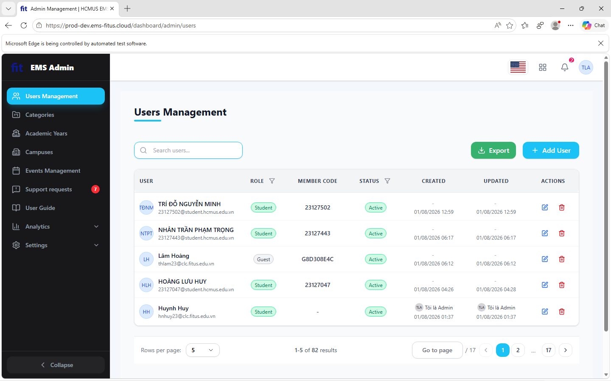  |
|                              | TC_C1_03    | macOS             | Firefox               | Desktop           | Pass                |                                                                                   | 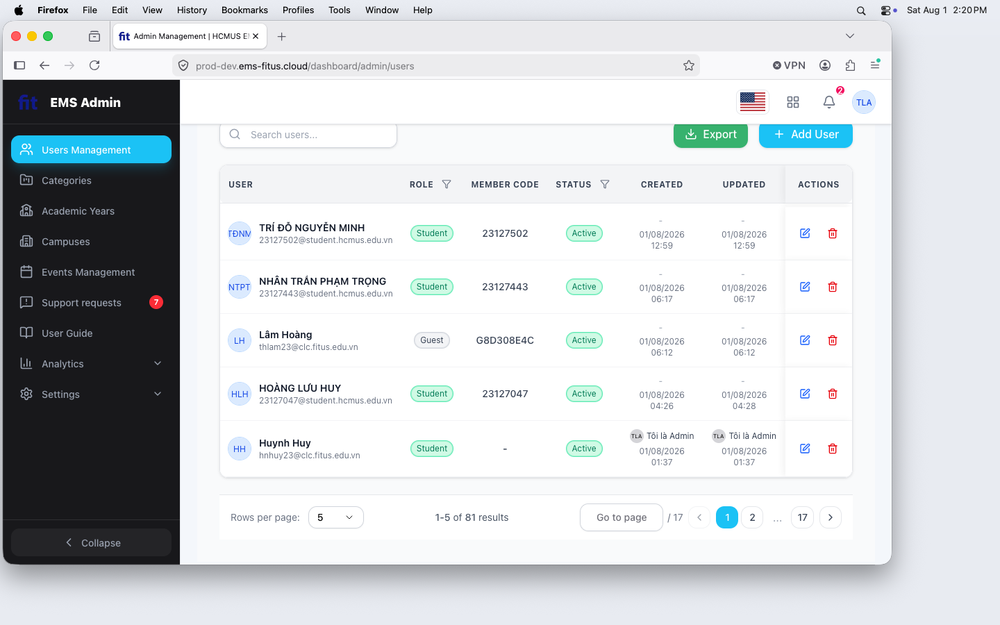  |
|                              | TC_C1_04    | macOS             | Safari                | Desktop           | Pass                |                                                                                   | 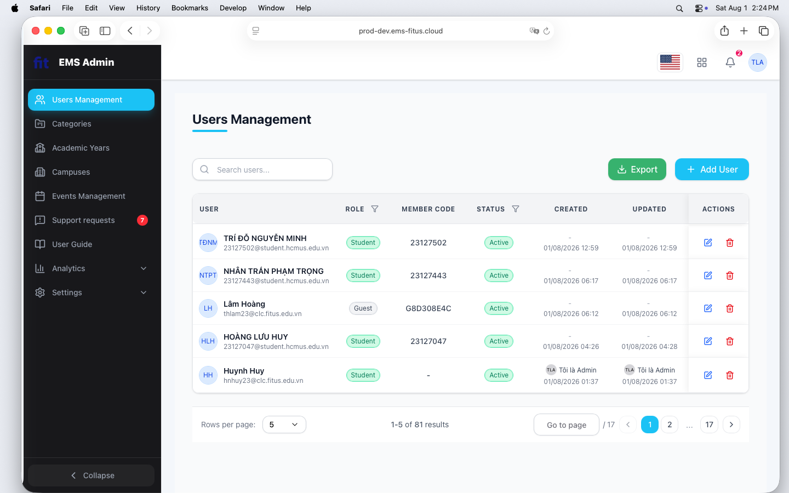  |
|                              | TC_C1_05    | iOS               | Safari                | Tablet (iPad)     | Fail                | Hàng hiển thị số trang bị tràn ra, trang tổng thể có thể scroll qua trái qua phải |   |
|                              | TC_C1_06    | Android           | Chrome                | Phone             | Fail                | UI lỗi hoàn toàn không thể sử dụng được                                           |  |
| **C2: Gán quyền / Sửa User** | TC_C2_01    | Windows 10        | Internet Explorer     | Desktop           | Fail                | Giao diện hoàn toàn trắng                                                         |         |
|                              | TC_C2_02    | Windows 11        | Edge                  | Desktop           | Pass                |                                                                                   | 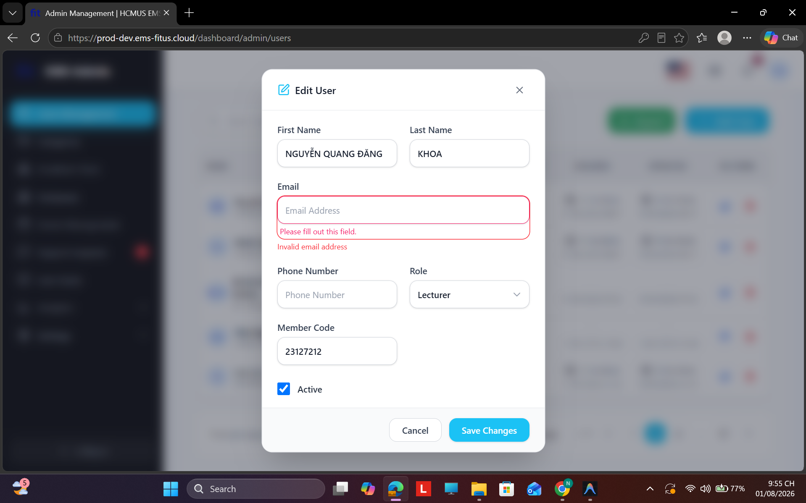  |
|                              | TC_C2_03    | macOS             | Firefox               | Desktop           | Pass                |                                                                                   | 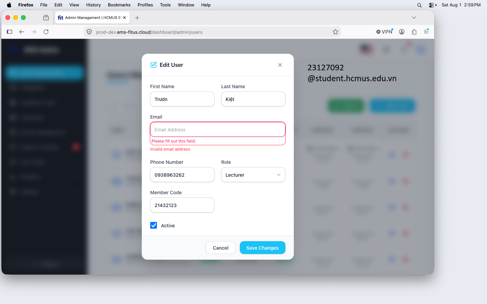  |
|                              | TC_C2_04    | macOS             | Safari                | Desktop           | Pass                |                                                                                   | 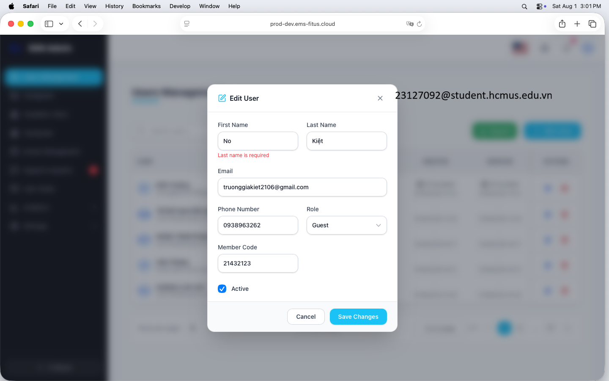  |
|                              | TC_C2_05    | iOS               | Safari                | Tablet (iPad)     | Pass                |                                                                                   | 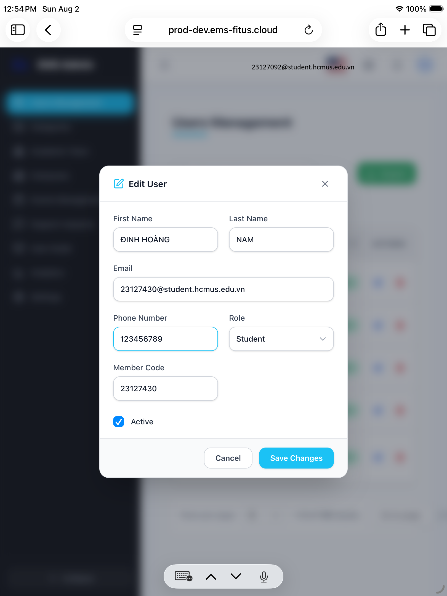  |
|                              | TC_C2_06    | Android           | Chrome                | Phone             | Fail                | UI lỗi hoàn toàn, rất khó sử dụng để edit                                         | 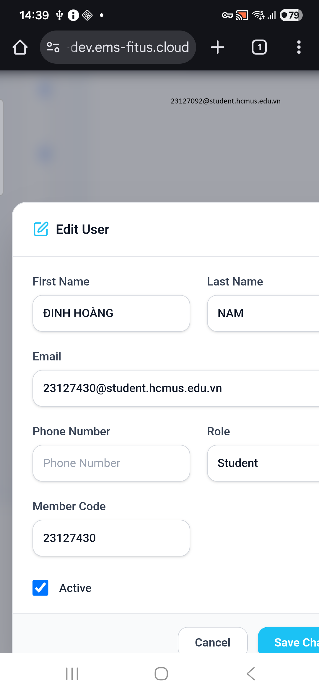  |
| **C3: Export danh sách**     | TC_C3_01    | Windows 10        | Internet Explorer     | Desktop           | Fail                | Giao diện hoàn toàn trắng                                                         |         |
|                              | TC_C3_02    | Windows 11        | Edge                  | Desktop           | Pass                |                                                                                   | 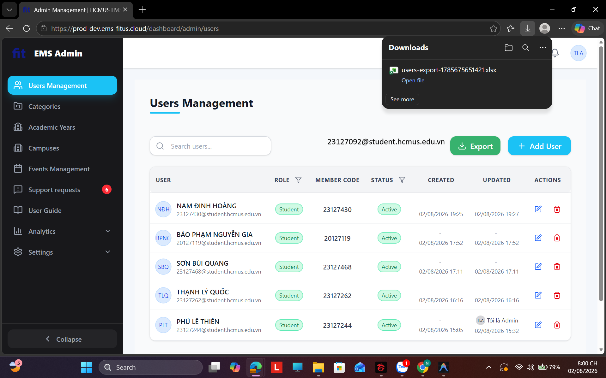  |
|                              | TC_C3_03    | macOS             | Firefox               | Desktop           | Pass                |                                                                                   | 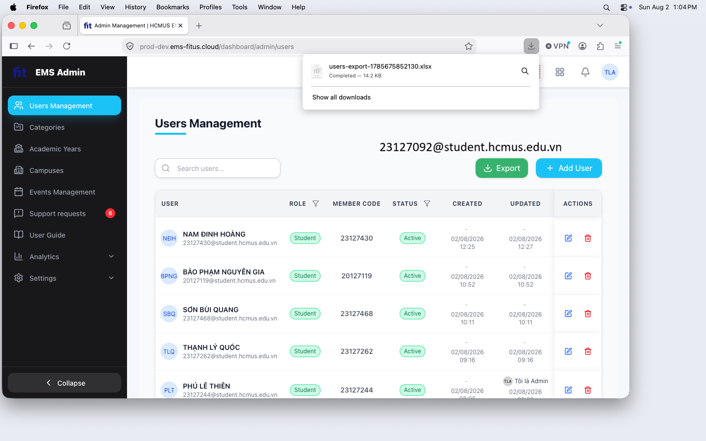  |
|                              | TC_C3_04    | macOS             | Safari                | Desktop           | Pass                |                                                                                   | 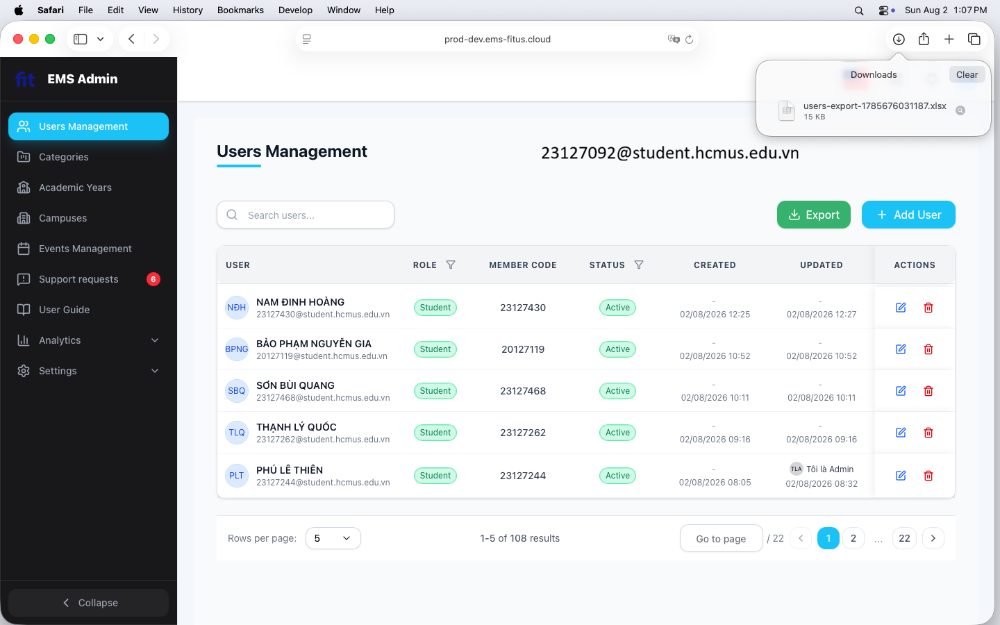  |
|                              | TC_C3_05    | iOS               | Safari                | Tablet (iPad)     | Pass                |                                                                                   | 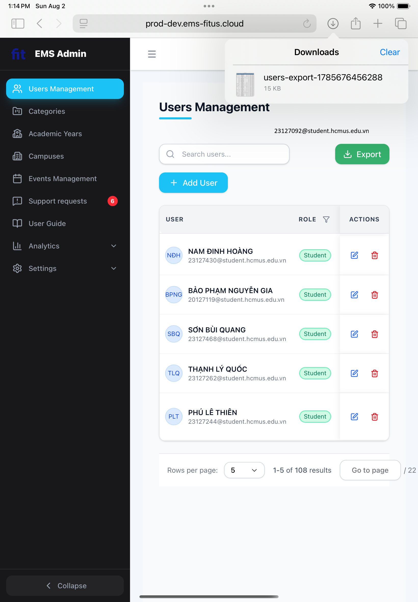  |
|                              | TC_C3_06    | Android           | Chrome                | Phone             | Fail                | UI lỗi hoàn toàn khiến cho export khó khăn mặc dù vẫn export thành công           | 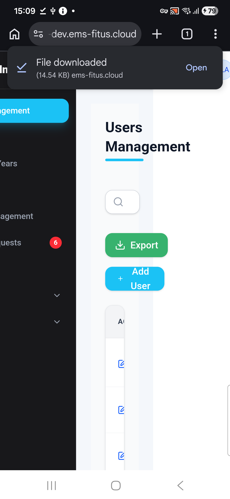  |
