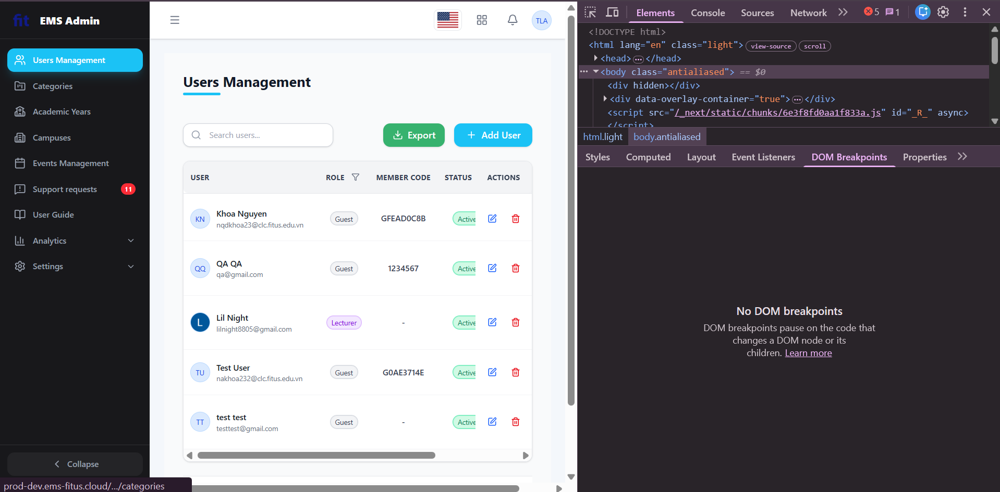

# Phân tích GUI & Usability — Màn hình C1: Danh sách Users (User List)

> **Kịch bản C — Admin quản lý người dùng**
> Phân tích dựa trên: 10 Heuristics (Nielsen), 6 Principles (Norman), 8 Golden Rules (Shneiderman)
> Đối chiếu với [GUI_Checklist_EMS.md](GUI_Checklist_EMS.md)

---

## 1. Mô tả màn hình

Trang **Users Management** phía Admin gồm các thành phần chính:

- **Sidebar trái** (dark navy): menu điều hướng với "Users Management" đang active (highlight xanh dương)
- **Header**: logo "EMS Admin", cờ US (ngôn ngữ), icon grid, icon chuông (notification), avatar user "TLA"
- **Vùng nội dung chính**:
  - Tiêu đề "Users Management" với underline xanh
  - Thanh tìm kiếm "Search users..."
  - 2 nút: **Export** (xanh lá) và **+ Add User** (xanh dương)
  - Bảng dữ liệu: cột USER, ROLE, MEMBER CODE, STATUS, CREATED, UPDATED, ACTIONS
  - 5 hàng dữ liệu user
- **Pagination**: "Rows per page: 5", "1-5 of 50 results", điều hướng trang (1, 2, ..., 10)

---

## 2. Bảng phát hiện vấn đề (Findings)

| #   | Vị trí trên màn hình                       | Vấn đề cụ thể                                                                                                                                                                                                                                             | Heuristic / Nguyên tắc bị vi phạm                                                                                                                 | Mức nghiêm trọng (0–4) | Đề xuất sửa                                                                                                                                                                                                                    | Checklist ID   |
| --- | ------------------------------------------ | --------------------------------------------------------------------------------------------------------------------------------------------------------------------------------------------------------------------------------------------------------- | ------------------------------------------------------------------------------------------------------------------------------------------------- | ---------------------- | ------------------------------------------------------------------------------------------------------------------------------------------------------------------------------------------------------------------------------ | -------------- |
| 1   | Cột **USER**                               | Tên user hiển thị không đồng nhất: có dòng dùng **ALL CAPS** (như "TRÍ ĐỖ NGUYỄN MINH"), có dòng lại dùng Title Case ("Lâm Hoàng"). Gây mất thẩm mỹ và thiếu tính chuyên nghiệp.                                                                                                | **Nielsen #4** (Consistency & Standards), **Shneiderman #1** (Consistency)                                                                        | **2**                  | Chuẩn hóa cách hiển thị tên: luôn dùng Title Case (`text-transform: capitalize`) hoặc giữ nguyên như user nhập nhưng phải validate khi đăng ký.                                                                                | GUI-02, GUI-04 |
| 2   | Cột **USER**, avatar initials              | Ký tự viết tắt trên avatar không đồng nhất về số lượng (từ 2 đến 4 ký tự), dẫn đến hiển thị lộn xộn, thiếu sự nhất quán trong giao diện.                                                | **Nielsen #4** (Consistency & Standards), **Nielsen #8** (Aesthetic & Minimalist Design), **Shneiderman #1** (Consistency)                        | **2**                  | Chuẩn hóa avatar initials: luôn lấy cố định **2 ký tự** (chữ cái đầu của Họ + Tên).                                                                        | GUI-10         |
| 3   | **Toàn trang** — Breadcrumb                | **Không có breadcrumb** hiển thị đường dẫn phân cấp (VD: "Admin > Users Management"). User không biết mình đang ở đâu trong cấu trúc site ngoài việc nhìn sidebar.                                                                                        | **Nielsen #1** (Visibility of System Status), **Nielsen #6** (Recognition Rather Than Recall), **Shneiderman #8** (Reduce Short-Term Memory Load) | **2**                  | Thêm breadcrumb ngay dưới header, trên tiêu đề trang: `Dashboard > Users Management`. Mỗi node có thể click để quay lại.                                                                                                       | GUI-28         |
| 4   | Cột **ACTIONS**                            | Chỉ có 2 icon action: Edit (xanh) và Delete (đỏ). **Thiếu các action quan trọng** cho quản trị user: Block/Unblock, Reset Password, View Detail, Assign Role. Admin phải click Edit mới truy cập được → tốn thêm bước.                                    | **Nielsen #7** (Flexibility & Efficiency), **Shneiderman #7** (Keep Users in Control)                                                             | **2**                  | Thêm icon action cho Block/Unblock, Reset Password trực tiếp trên hàng; hoặc dùng dropdown menu "⋮" (more actions) chứa tất cả action phụ.                                                                                     | GUI-09, GUI-11 |
| 5   | Cột **ACTIONS** — icon Edit và Delete      | 2 icon action **quá nhỏ** (~20×20px) và **đặt sát nhau** (khoảng cách ~10px). Dễ bấm nhầm Delete thay vì Edit, đặc biệt trên thiết bị cảm ứng. Vi phạm **Fitts' Law** — target quá nhỏ cho hành động có hậu quả khác nhau lớn.                            | **Nielsen #5** (Error Prevention), **Shneiderman #5** (Prevent Errors), **Norman #3** (Constraints)                                               | **3**                  | Tăng kích thước icon action (≥ 32×32px). Tăng khoảng cách giữa Edit và Delete (≥ 16px). Cân nhắc tách Delete ra khỏi hàng actions trực tiếp, đưa vào dropdown menu hoặc yêu cầu chọn trước (checkbox) rồi mới hiện nút Delete. | GUI-11, GUI-38 |
| 6   | Thanh tìm kiếm **"Search users..."**       | Thanh search chỉ có placeholder, **không có label** phía trên hoặc bên cạnh. Khi focus vào ô, placeholder biến mất → user không nhớ trường này dùng để tìm gì (tìm theo tên? email? member code?). Không có hướng dẫn phạm vi tìm kiếm.                   | **Nielsen #6** (Recognition Rather Than Recall), **Nielsen #10** (Help & Documentation), **Shneiderman #8** (Reduce Short-Term Memory Load)       | **1**                  | Giữ placeholder chi tiết hơn: "Search by name, email or member code…". Hoặc thêm label/hint text bên ngoài ô search. Thêm nút clear (×) khi có text trong ô.                                                                   | GUI-14, GUI-24 |
| 7   | **Header bảng** — Các cột                  | Các cột **không có chỉ báo sort** (sort indicator ↑↓). Không rõ bảng đang sắp xếp theo gì, và cột nào có thể click để sort. User phải thử click từng header để xem có sort được không.                                                                    | **Nielsen #1** (Visibility of System Status), **Nielsen #6** (Recognition Rather Than Recall), **Norman #1** (Visibility)                         | **2**                  | Thêm icon ↕ (sort ascending/descending) trên mỗi cột sortable. Cột đang sort active hiển thị ↑ hoặc ↓. Cursor đổi thành pointer khi hover lên header sortable.                                                                 | GUI-09         |
| 8   | **Bảng dữ liệu** — Toàn bộ                 | **Không có checkbox** ở mỗi hàng để chọn nhiều user. Admin không thể thực hiện bulk actions (block nhiều user, export user đã chọn, assign role hàng loạt). Phải thao tác từng user một.                                                                  | **Nielsen #7** (Flexibility & Efficiency), **Shneiderman #7** (Keep Users in Control)                                                             | **2**                  | Thêm cột checkbox ở đầu mỗi hàng + checkbox "Select All" ở header. Khi chọn ≥ 1 user, hiện action bar floating: "3 selected — [Block] [Export] [Assign Role] [Delete]".                                                        | GUI-07         |
| 9   | Cột **USER** — Email                       | Thiếu tooltip cho email: Dù email đang hiển thị đủ trên màn hình rộng, nhưng **không có tooltip** hiển thị đầy đủ khi hover. Trên màn hình nhỏ, nếu email bị cắt (text-overflow) admin sẽ không xem được.                                           | **Nielsen #1** (Visibility of System Status), **Norman #1** (Visibility), **Shneiderman #3** (Informative Feedback)                               | **1**                  | Thêm tooltip (`title` attribute) hiển thị email đầy đủ khi hover. Dùng `text-overflow: ellipsis` có kiểm soát, kèm tooltip. Hoặc cho phép expand hàng khi click.                                                               | GUI-05         |
| 10  | **Tiêu đề trang**                          | "**Users Management**" — ngữ pháp tiếng Anh không chuẩn. Đúng phải là "**User Management**" (danh từ ghép dùng số ít) theo convention phổ biến (giống "Event Management", "Order Management").                                                            | **Nielsen #2** (Match Between System & Real World), **Nielsen #4** (Consistency & Standards)                                                      | **1**                  | Sửa thành "User Management" (số ít) cho đúng ngữ pháp tiếng Anh. Hoặc nếu dùng đa ngôn ngữ, đảm bảo bản dịch tiếng Việt cũng chính xác: "Quản lý người dùng".                                                                  | GUI-08         |
| 11  | **Header bảng** — Typography               | Header bảng dùng **ALL CAPS** ("USER", "ROLE", "MEMBER CODE", "STATUS", "CREATED", "UPDATED", "ACTIONS"). Nghiên cứu typography cho thấy ALL CAPS **giảm tốc độ đọc ~13-20%** vì mất hình dạng chữ (word shape).                                          | **Nielsen #8** (Aesthetic & Minimalist Design), **Shneiderman #2** (Universal Usability)                                                          | **1**                  | Chuyển sang **Title Case** ("User", "Role", "Member Code") hoặc **Sentence case** ("User", "Role", "Member code"). Dùng font-weight: 600 (semi-bold) thay vì CAPS để phân biệt header với data.                                | GUI-02         |
| 12  | **Cột CREATED & UPDATED** — Thông tin thừa | Cột UPDATED (ở một số dòng) có hiển thị avatar nhỏ + "Tôi là Admin" + ngày giờ. Avatar nhỏ trong ô bảng (~16px) **gần như không nhận diện được**, chỉ thêm noise thị giác. Thông tin "ai tạo/sửa" hiếm khi cần xem trên list view.                                          | **Nielsen #8** (Aesthetic & Minimalist Design), **Shneiderman #8** (Reduce Short-Term Memory Load)                                                | **1**                  | Chỉ hiển thị ngày giờ trên list view. Đưa thông tin "Created by / Updated by" vào trang detail hoặc tooltip khi hover. Giảm clutter cho bảng.                                                                                  | GUI-04         |
| 13  | **Nút "Add User"** — vị trí                | Nút **"+ Add User"** nằm ở **góc trên phải**, cùng hàng với ô Search. Trên màn hình nhỏ, nút này có thể bị ẩn hoặc xuống hàng mới. Ngoài ra, không rõ nút này tạo user mới trực tiếp hay mở form riêng.                                                   | **Norman #1** (Visibility), **Shneiderman #2** (Universal Usability)                                                                              | **1**                  | Đảm bảo nút Add User luôn hiển thị trên mọi viewport. Cân nhắc đặt floating action button (FAB) trên mobile. Text nút nên ghi rõ: "+ Add New User".                                                                            | GUI-05, GUI-11 |
| 14  | **Toàn trang** — Keyboard accessibility    | (Đã kiểm chứng thực tế: PASS) Focus ring di chuyển logic, hiển thị rõ ràng, phím Enter kích hoạt được các action icons bình thường. Không phát hiện lỗi accessibility cơ bản.                                                                             | **Shneiderman #2** (Universal Usability), **Nielsen #7** (Flexibility & Efficiency), **WCAG 2.1**                                                 | **0**                  | Không cần sửa (tính năng hoạt động đúng kỳ vọng).                                                                                                                                                                              | GUI-12         |
| 15  | **Responsive** — Sidebar & Bảng            | Khi thu nhỏ màn hình, bảng xuất hiện thanh cuộn ngang (chống vỡ layout tốt). Tuy nhiên, sidebar không tự động collapse để nhường không gian cho nội dung, dù icon hamburger (≡) đã xuất hiện.        | **Shneiderman #2** (Universal Usability), **Nielsen #7** (Flexibility & Efficiency)                                                               | **2**                  | Tự động collapse sidebar thành dạng icon hoặc ẩn hẳn vào hamburger menu khi kích thước màn hình nhỏ.                                                                                                                           | GUI-05, GUI-33 |

---

## 3. Đối chiếu Checklist — Kết quả chạy trên màn hình C1

| Checklist ID | Tên tiêu chí             | Kết quả     | Ghi chú                                                                                                                                   |
| ------------ | ------------------------ | ----------- | ----------------------------------------------------------------------------------------------------------------------------------------- |
| GUI-01       | Layout nhất quán         | **Passed**  | Sidebar, header, content area giữ đúng vị trí. |
| GUI-02       | Typography nhất quán     | **Failed**  | ALL CAPS header bảng; tên user không nhất quán (CAPS vs Title Case). Xem #1, #10. Xem #1, #10, #10. Xem #1, #10, #10. Xem #1, #10. Xem #1, #10. |
| GUI-03       | Bảng màu nhất quán       | **Passed**  | Màu sắc các nút (Add xanh dương, Export xanh lá, Delete đỏ) nhất quán với ngữ nghĩa. |
| GUI-04       | Canh lề & Spacing        | **Partial** | Layout tổng thể OK, nhưng cột CREATED/UPDATED có quá nhiều thông tin chen chúc. Xem #1, #10, #19. Xem #1, #10, #18. Xem #1, #10, #10. Xem #1, #10, #10. |
| GUI-05       | Responsive design        | **Partial** | Bảng có thanh cuộn ngang chống vỡ layout, nhưng sidebar không tự động collapse. Xem #10, #18, #21. Xem #9, #10, #20. Xem #9, #10, #19. Xem #9, #10, #10. |
| GUI-06       | Empty state              | **Passed**  | Bảng hiển thị thông báo rõ ràng "No users found matching your filters." khi không có dữ liệu. |
| GUI-07       | Loading state            | **Passed**  | Hệ thống hiển thị spinner khi chuyển trang, báo hiệu rõ ràng trạng thái tải dữ liệu. Xem #8. |
| GUI-08       | i18n EN/VI               | **Failed**  | Tiêu đề "Users Management" sai ngữ pháp. Xem #10. |
| GUI-09       | Icon rõ ràng & nhất quán | **Failed**  | thiếu sort icon trên cột; thiếu action icons cho Block/Reset. Xem #4, #7, #10. Xem #4, #8. Xem #4, #7. Xem #4, #7. Xem #4, #7. |
| GUI-10       | Avatar hiển thị đúng     | **Failed**  | Avatar initials không nhất quán (2-4 ký tự), chữ bị nhỏ khó đọc. Xem #2. |
| GUI-11       | Button states            | **Passed**  | Các nút có hiệu ứng đổi màu khi hover báo hiệu click được (dù không hiện icon bàn tay). Vẫn lưu ý icon action nhỏ (#5). Xem #4, #5, #18, #19. Xem #4, #5, #10, #18. Xem #4, #5, #10, #10. Xem #4, #5, #10, #10. |
| GUI-12       | Keyboard navigation      | **Passed**  | Hệ thống hỗ trợ điều hướng bằng phím Tab logic (focus ring rõ ràng) và phím Enter kích hoạt được action icons. Xem #10, #20. Xem #10, #19. Xem #10, #18. Xem #10, #10. |
| GUI-13       | ARIA & Heading           | **Passed**  | Kiểm tra mã HTML bằng DevTools cho thấy icon action (như Edit) có thuộc tính `aria-label="Edit user"`, hỗ trợ tốt cho trình đọc màn hình. |
| GUI-14       | Label form field         | **Failed**  | Ô search chỉ có placeholder, không có label visible. Xem #6. |
| GUI-22       | **Passed**  | **Failed**  | Filter ROLE/STATUS hoạt động trực tiếp qua icon trên header cột. |
| GUI-24       | Placeholder ≠ Label      | **Failed**  | Search box dùng placeholder "Search users..." thay cho label. Xem #6. |
| GUI-27       | Sidebar active state     | **Passed**  | "Users Management" được highlight xanh dương, rõ ràng. Xem #10. |
| GUI-28       | Breadcrumb               | **Failed**  | Không có breadcrumb. Xem #3. |
| GUI-32       | **Passed**  | **Partial** | Có phân trang hiển thị số dòng rõ ràng, cung cấp đủ tùy chọn rows per page. |
| GUI-33       | Sidebar collapse/expand  | **Failed**  | Sidebar không tự collapse trên màn hình nhỏ dù đã có icon hamburger. Xem #10. |
| GUI-39       | Màu trạng thái           | **Passed**  | Status "Active" badge màu xanh lá phù hợp quy ước. (Cần verify Blocked state.) |
| GUI-41       | Badge/counter            | **Passed**  | Support requests có badge đỏ "7" trên sidebar. |

---

## 4. Tổng hợp theo mức nghiêm trọng

| Mức nghiêm trọng      | Mô tả                   | Số vấn đề | Finding #                                            |
| --------------------- | ----------------------- | --------- | ---------------------------------------------------- |
| **4 — Catastrophe**   | Usability catastrophe   | **0**     | —                                                    |
| **3 — Major**         | Major usability problem | **1**     | #5 (Action icons nhỏ sát nhau)       |
| **2 — Minor**         | Minor usability problem | **6**     | #1, #2, #3, #4, #7, #8, #10           |
| **1 — Cosmetic**      | Cosmetic problem only   | **7**     | #6, #9, #9, #11, #12, #13 |
| **0 — Not a problem** | Not a usability problem | **1**     | #10                                                  |

---

## 5. Tổng hợp theo Interface Aspect (IA)

| Aspect                       | Findings liên quan                                          | Số lượng |
| ---------------------------- | ----------------------------------------------------------- | -------- |
| **IA-01** — Chuẩn UI chung   | #1, #2, #7, #9, #9, #11, #12, #14, #15 | 9       |
| **IA-02** — Forms            | #6                                                     | 2        |
| **IA-03** — Navigation       | #3, #4, #10                                  | 6        |
| **IA-04** — Feedback / State | #5, #8, #10                                            | 3        |

---

## 6. Tổng hợp theo Nguyên tắc bị vi phạm nhiều nhất

| Nguyên tắc                                         | Số lần vi phạm |
| -------------------------------------------------- | -------------- |
| **Nielsen #4** — Consistency & Standards           | 5 |
| **Nielsen #6** — Recognition Rather Than Recall    | 2 |
| **Shneiderman #1** — Strive for Consistency        | 4 |
| **Shneiderman #8** — Reduce Short-Term Memory Load | 2 |
| **Nielsen #7** — Flexibility & Efficiency          | 4 |
| **Norman #1** — Visibility                         | 4              |
| **Nielsen #1** — Visibility of System Status       | 3              |
| **Shneiderman #2** — Seek Universal Usability      | 3 |

---

## 7. Kết luận

Trang **Users Management (User List)** có layout tổng thể ổn định và sidebar active state rõ ràng. Tuy nhiên, phát hiện **14 vấn đề** về GUI/Usability, trong đó:

- **1 vấn đề Major (mức 3)**: Icon action quá nhỏ và sát nhau gây nguy cơ bấm nhầm Delete.
- **Nhóm vi phạm nhiều nhất**: Consistency & Standards (Nielsen #4, Shneiderman #1) — do trộn ngôn ngữ EN/VI, tên user CAPS/Title Case không thống nhất, avatar initials bất đồng nhất.
- **Thiếu sót đáng chú ý**: Không có breadcrumb, không có bulk selection, không có sort indicators, thiếu tooltip cho icon actions.

> [!IMPORTANT]
> Các vấn đề mức 3 cần được ưu tiên sửa trước vì ảnh hưởng trực tiếp đến hiệu quả làm việc và rủi ro thao tác nhầm của admin.
