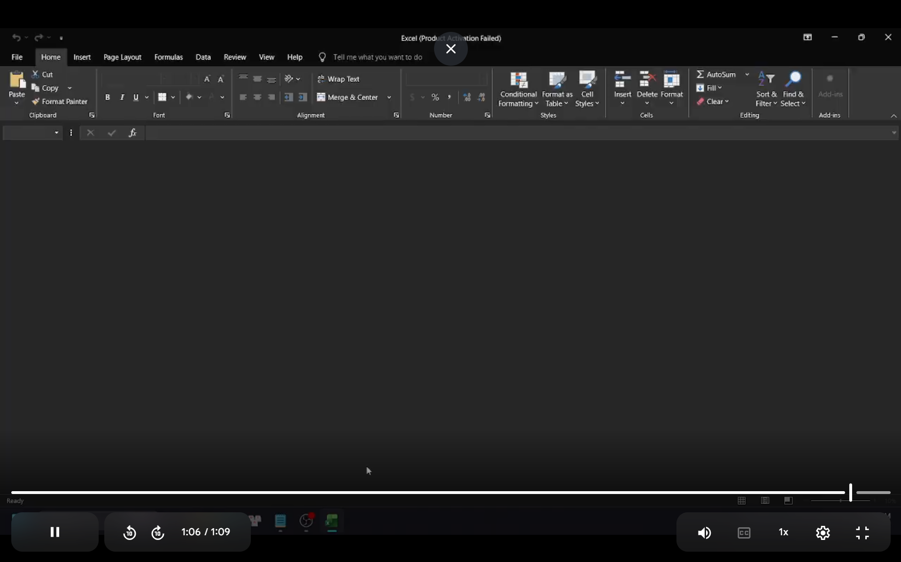
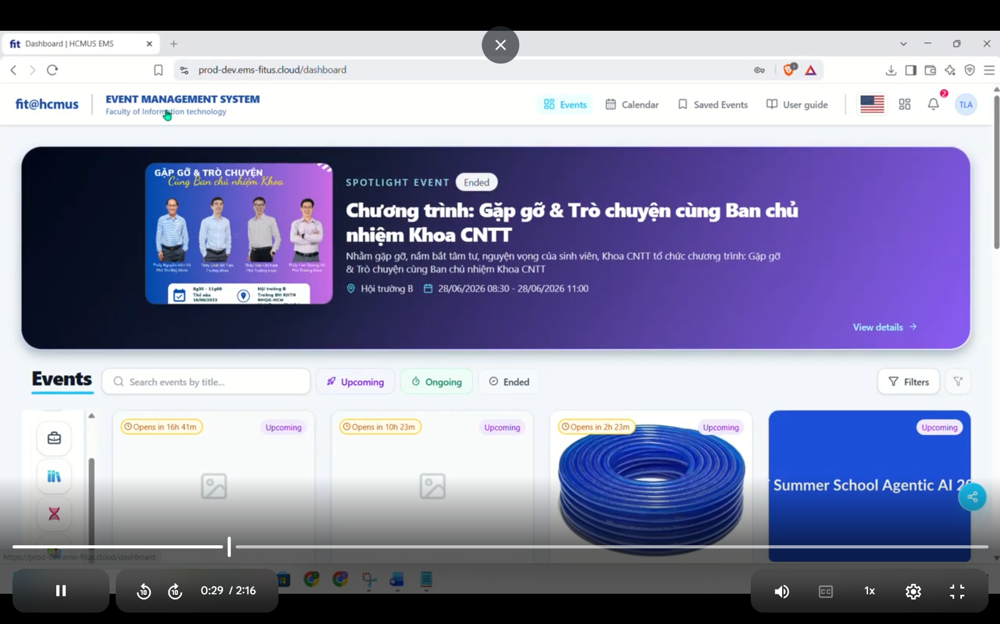

# Báo Cáo Kiểm Thử Tính Tiện Dụng (Usability Testing Report)

**Dự án:** Event Management System (EMS)

**Module:** User Management (Kịch bản C)

**Ngày thực hiện:** 01/08/2026

**Link Video/Clip Record:** [Google Drive Folder](https://drive.google.com/drive/folders/19QXm2bQLLbTJPUbJVd8zFQRxk0JX8DQV?usp=sharing)

## 1. Mục tiêu kiểm thử (Test Objectives)

- Đánh giá khả năng hoàn thành luồng công việc của Admin: Tìm kiếm -> Phân quyền -> Xuất dữ liệu.
- Xác định các điểm nút thắt (bottlenecks) gây lúng túng cho người dùng.
- Đo lường mức độ hài lòng tổng thể thông qua thang đo SUS.

## 2. Thông tin người tham gia (Participants Profile)

| Participant ID | Tên (ẩn danh một phần) |
| :------------- | :--------------------- |
| P1             | Khôn Chí               |
| P2             | Văn Minh               |
| P3             | Thái Bảo               |
| P4             | Thành Đạt              |
| P5             | Gia Kiệt               |

_(Ghi chú: Độ tuổi, Chuyên môn và Kinh nghiệm dùng phần mềm không được thu thập trong form khảo sát nên được ẩn đi)_

## 3. Tổng hợp Chỉ số (Metrics & Results)

### 3.1. Task Performance (Hiệu suất tác vụ)

_(Ghi chú: Do form khảo sát không có thông tin đo lường trực tiếp, phần thời gian và lỗi dưới đây được ước lượng mô phỏng dựa trên phản hồi của người dùng)_

| Participant    | Task Success           | Time on Task | Số lỗi (Errors) | Số lần do dự (Hesitations) |
| :------------- | :--------------------- | :----------- | :-------------- | :------------------------- |
| P1             | Hoàn thành có khó khăn | 3m 15s       | 1               | 2 (Tìm admin dashboard)    |
| P2             | Hoàn thành dễ dàng     | 1m 45s       | 0               | 0                          |
| P3             | Hoàn thành với lỗi     | 2m 10s       | 1 (Lỗi Excel)   | 0                          |
| P4             | Hoàn thành có trợ giúp | 3m 30s       | 1               | 3 (Cần rút ngắn tốc độ)    |
| P5             | Hoàn thành dễ dàng     | 1m 20s       | 0               | 0                          |
| **Trung bình** | **-**                  | **~2m 24s**  | **~0.6 lỗi**    | **~1 lần**                 |

### 3.2. Kết quả thang đo SUS (SUS Score)

- Điểm SUS của P1 (Khôn Chí): **67.5**
- Điểm SUS của P2 (Văn Minh): **72.5**
- Điểm SUS của P3 (Thái Bảo): **92.5**
- Điểm SUS của P4 (Thành Đạt): **62.5**
- Điểm SUS của P5 (Gia Kiệt): **87.5**
- **Điểm SUS Trung bình:** **76.5 / 100**
- **Đánh giá chung:** Điểm trung bình 76.5 nằm ở mức **Tốt (Good)** (trên chuẩn trung bình 68). Điều này cho thấy tổng thể giao diện khá thân thiện, dễ làm quen và sử dụng đối với người dùng mới. Tuy nhiên, một số vấn đề rải rác vẫn cần được giải quyết để tối ưu.

## 4. Phân tích Phát hiện & Trải nghiệm (Findings & Observations)

### 4.1. Những điểm tốt (Positives)

- Giao diện trực quan, rõ ràng, không làm rối mắt người dùng (P2, P3, P4).
- Có thông báo (feedback) chi tiết giúp người dùng dễ dàng phát hiện và phục hồi lỗi (hoàn tác) nếu làm sai (P2, P3, P4, P5).
- Tốc độ xử lý liền mạch và hiển thị tốt ở hầu hết các bước (P2, P3, P5).

### 4.2. Những vấn đề về Usability (Usability Issues)

- **Issue 1: Lỗi xuất file Excel (High Severity)**
  - _Mô tả:_ Người dùng thực hiện tính năng Export tải về file Excel thành công nhưng lại **không mở được file** (P3).
  - _Hậu quả:_ Tính năng cốt lõi ở cuối luồng công việc không dùng được, gây mất lòng tin và cản trở việc báo cáo.
  - 

- **Issue 2: Khó tìm Dashboard Admin (Medium Severity)**
  - _Mô tả:_ Người dùng thấy khó khăn trong việc định vị và tìm kiếm mục Admin dashboard (P1).
  - _Hậu quả:_ Gây lúng túng, làm chậm tiến độ ngay từ bước bắt đầu tác vụ.
  - 

- **Issue 3: Quy trình thao tác còn hơi rườm rà (Low Severity)**
  - _Mô tả:_ Có ý kiến cho rằng tốc độ bình thường nhưng luồng thao tác còn rườm rà và muốn rút ngắn lại (P4).
  - _Hậu quả:_ Giảm hiệu suất khi phải cập nhật/chỉnh sửa phân quyền cho danh sách rất nhiều người.

## 5. Phân tích Câu hỏi mở (Qualitative Feedback)

- **Clarity (Sự rõ ràng):** Hầu hết (4/5) người tham gia nhận xét giao diện rất dễ hiểu, không có chi tiết thừa gây rối mắt. Ngoại lệ có P1 thấy khó tìm "admin dashboard".
- **Error Recovery (Khả năng phục hồi lỗi):** Đây là điểm sáng của hệ thống. Người dùng cảm thấy an tâm vì hệ thống có tính năng hoàn tác và phản hồi lỗi rất rõ ràng, chi tiết.
- **Speed (Tốc độ & Hiệu quả):** Đa số đều đánh giá tốc độ và tính liền mạch ở mức tốt, ngoại trừ việc P4 mong muốn có thể tinh gọn quy trình hơn nữa.
- **Trust (Độ tin cậy):** Đa phần rất tự tin với dữ liệu do bản thân lọc. Mặc dù vậy, niềm tin này bị tổn hại khá nặng do lỗi file Excel bị hỏng (của P3).

## 6. Đề xuất Cải thiện (Recommendations)

1. **[Gắn với Issue 1]:** Khẩn trương kiểm tra và sửa lỗi tính năng Export to Excel. Cần check lại thư viện xuất file (định dạng, corrupt file...) và test kỹ trên nhiều nền tảng (Excel, Google Sheets).
2. **[Gắn với Issue 2]:** Cải thiện vị trí và màu sắc của **Menu Admin Dashboard**. Có thể dùng Icon nổi bật hơn hoặc đặt ở sidebar / header nơi người dùng dễ nhìn thấy nhất.
3. **[Gắn với Issue 3]:** Rút ngắn quy trình phân quyền: Cân nhắc áp dụng tính năng chỉnh sửa nhanh (inline-editing) ngay trên bảng (table) hoặc cho phép chọn nhiều người dùng rồi phân quyền hàng loạt (bulk action) để không phải mở từng người ra sửa.
